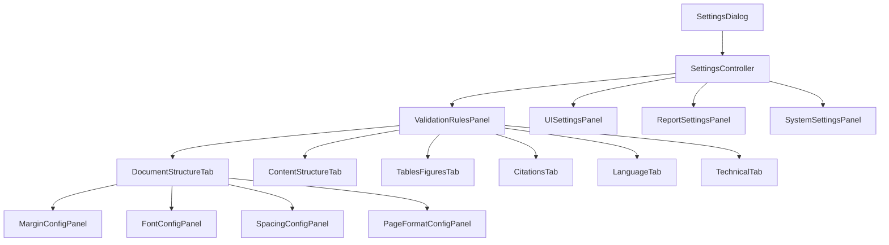
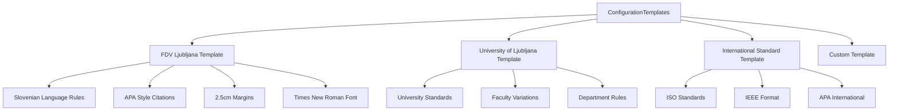

# TechCheck - Configuration System Design
## Rule Customization & Settings Management

---

## 🎯 Configuration System Overview

The TechCheck configuration system provides flexible rule customization for different institutions, document types, and validation requirements. This allows FDV Ljubljana technical staff to adapt validation rules while maintaining system integrity.

---

## 📋 Configuration Architecture

### Core Configuration Classes

```mermaid
classDiagram
    class IConfigurationProvider {\n        <<interface>>\n        +getValidationRules(): ValidationRules\n        +getUISettings(): UISettings\n        +getReportSettings(): ReportSettings\n        +saveConfiguration(config: TechCheckConfig): void\n        +loadConfiguration(): TechCheckConfig\n        +resetToDefaults(): void\n    }

    class ConfigurationManager {\n        -configProvider: IConfigurationProvider\n        -cache: Map~String,Object~\n        -listeners: List~ConfigChangeListener~\n        +getInstance(): ConfigurationManager\n        +getValidationRules(): ValidationRules\n        +updateValidationRules(rules: ValidationRules): void\n        +addChangeListener(listener: ConfigChangeListener): void\n        +notifyConfigChanged(key: String): void\n        +exportConfiguration(filePath: String): void\n        +importConfiguration(filePath: String): void\n    }

    class ValidationRules {\n        -documentStructureRules: DocumentStructureRules\n        -contentStructureRules: ContentStructureRules\n        -tablesFiguresRules: TablesFiguresRules\n        -citationRules: CitationRules\n        -languageRules: LanguageRules\n        -technicalRules: TechnicalRules\n        +getModuleRules(moduleType: ModuleType): IModuleRules\n        +setModuleRules(moduleType: ModuleType, rules: IModuleRules): void\n        +validateConfiguration(): List~ConfigurationError~\n    }

    class DocumentStructureRules {\n        -marginSettings: MarginSettings\n        -fontSettings: FontSettings\n        -spacingSettings: SpacingSettings\n        -pageSettings: PageSettings\n        -enabled: boolean\n        +getMarginSettings(): MarginSettings\n        +setMarginSettings(settings: MarginSettings): void\n        +isEnabled(): boolean\n        +setEnabled(enabled: boolean): void\n    }

    IConfigurationProvider <|.. FileConfigurationProvider\n    IConfigurationProvider <|.. DatabaseConfigurationProvider\n    ConfigurationManager --> IConfigurationProvider\n    ConfigurationManager --> ValidationRules\n    ValidationRules --> DocumentStructureRules
```

### Configuration Data Models

```mermaid
classDiagram
    class TechCheckConfig {\n        -version: String\n        -institution: String\n        -lastModified: LocalDateTime\n        -validationRules: ValidationRules\n        -uiSettings: UISettings\n        -reportSettings: ReportSettings\n        +getVersion(): String\n        +getInstitution(): String\n        +getValidationRules(): ValidationRules\n        +getUISettings(): UISettings\n        +getReportSettings(): ReportSettings\n    }

    class MarginSettings {\n        -topMargin: double\n        -bottomMargin: double\n        -leftMargin: double\n        -rightMargin: double\n        -tolerance: double\n        -unit: MeasurementUnit\n        -enabled: boolean\n        +getTopMargin(): double\n        +setTopMargin(margin: double): void\n        +getTolerance(): double\n        +setTolerance(tolerance: double): void\n        +isEnabled(): boolean\n    }

    class FontSettings {\n        -allowedFontFamilies: List~String~\n        -defaultFontFamily: String\n        -fontSize: int\n        -fontSizeTolerance: int\n        -headingFontRules: Map~Integer,FontRule~\n        -enabled: boolean\n        +getAllowedFontFamilies(): List~String~\n        +addAllowedFont(fontFamily: String): void\n        +getDefaultFontFamily(): String\n        +getFontSize(): int\n        +getHeadingFontRule(level: int): FontRule\n    }

    class SpacingSettings {\n        -lineSpacing: double\n        -lineSpacingTolerance: double\n        -paragraphSpacing: double\n        -beforeParagraph: double\n        -afterParagraph: double\n        -enabled: boolean\n        +getLineSpacing(): double\n        +setLineSpacing(spacing: double): void\n        +getLineSpacingTolerance(): double\n        +getParagraphSpacing(): double\n    }

    class PageSettings {\n        -pageFormat: PageFormat\n        -orientation: PageOrientation\n        -allowedFormats: List~PageFormat~\n        -enabled: boolean\n        +getPageFormat(): PageFormat\n        +setPageFormat(format: PageFormat): void\n        +getOrientation(): PageOrientation\n        +isFormatAllowed(format: PageFormat): boolean\n    }

    TechCheckConfig --> MarginSettings\n    TechCheckConfig --> FontSettings\n    TechCheckConfig --> SpacingSettings\n    TechCheckConfig --> PageSettings
```

---

## 🎛️ Configuration User Interface

### Settings Dialog Architecture



### Settings UI Components

#### **1. Document Structure Settings Tab**
```
┌─────────────────────────────────────────────────────────────┐
│ Document Structure & Layout Settings                       │
├─────────────────────────────────────────────────────────────┤
│ Margin Settings                                             │
│ ┌─────────────────────────────────────────────────────────┐ │
│ │ ☑ Enable margin validation                              │ │
│ │                                                         │ │
│ │ Margin Requirements:                                    │ │
│ │   Top:    [2.5] cm    ±[0.1] cm tolerance              │ │
│ │   Bottom: [2.5] cm    ±[0.1] cm tolerance              │ │
│ │   Left:   [2.5] cm    ±[0.1] cm tolerance              │ │
│ │   Right:  [2.5] cm    ±[0.1] cm tolerance              │ │
│ │                                                         │ │
│ │ ☑ Use same margin for all sides                        │ │
│ │ Unit: ○ Centimeters ○ Inches ○ Points                  │ │
│ └─────────────────────────────────────────────────────────┘ │
│                                                             │
│ Font Settings                                               │
│ ┌─────────────────────────────────────────────────────────┐ │
│ │ ☑ Enable font validation                                │ │
│ │                                                         │ │
│ │ Main Text Font:                                         │ │
│ │   Font Family: [Times New Roman       ▼]               │ │
│ │   Font Size:   [12] pt ±[0] pt tolerance               │ │
│ │                                                         │ │
│ │ Allowed Fonts: [Manage Font List...]                   │ │
│ │                                                         │ │
│ │ Heading Fonts:                                          │ │
│ │   H1: [Times New Roman ▼] [16] pt [Bold ▼]            │ │
│ │   H2: [Times New Roman ▼] [14] pt [Bold ▼]            │ │
│ │   H3: [Times New Roman ▼] [12] pt [Bold ▼]            │ │
│ └─────────────────────────────────────────────────────────┘ │
│                                                             │
│ Spacing Settings                                            │
│ ┌─────────────────────────────────────────────────────────┐ │
│ │ ☑ Enable spacing validation                             │ │
│ │                                                         │ │
│ │ Line Spacing: [1.5] ±[0.05] tolerance                  │ │
│ │ Paragraph Spacing:                                      │ │
│ │   Before: [0] pt                                        │ │
│ │   After:  [6] pt                                        │ │
│ │                                                         │ │
│ │ ☑ Check heading spacing                                 │ │
│ │ ☑ Check list spacing                                    │ │
│ └─────────────────────────────────────────────────────────┘ │
└─────────────────────────────────────────────────────────────┘
```

#### **2. Advanced Configuration Panel**
```
┌─────────────────────────────────────────────────────────────┐
│ Advanced Configuration                                      │
├─────────────────────────────────────────────────────────────┤
│ Validation Severity Levels                                  │
│ ┌─────────────────────────────────────────────────────────┐ │
│ │ Rule Type              │ Severity    │ Stop on Error │   │ │
│ │ Margin violations      │ [Major  ▼]  │ ☐            │   │ │
│ │ Font family violations │ [Major  ▼]  │ ☐            │   │ │
│ │ Font size violations   │ [Minor  ▼]  │ ☐            │   │ │
│ │ Line spacing errors    │ [Major  ▼]  │ ☐            │   │ │
│ │ Page format errors     │ [Critical▼] │ ☑            │   │ │
│ └─────────────────────────────────────────────────────────┘ │
│                                                             │
│ Custom Validation Rules                                     │
│ ┌─────────────────────────────────────────────────────────┐ │
│ │ [Add Custom Rule...]                                    │ │
│ │                                                         │ │
│ │ Custom Rule 1: "Chapter titles must be in bold"        │ │
│ │ └─ Pattern: ^(Chapter|Poglavje)\s+\d+                  │ │
│ │ └─ Required: Bold formatting                            │ │
│ │ └─ [Edit] [Delete]                                      │ │
│ │                                                         │ │
│ │ Custom Rule 2: "Maximum 3 heading levels"              │ │
│ │ └─ Check: Heading depth                                 │ │
│ │ └─ Maximum: 3 levels                                    │ │
│ │ └─ [Edit] [Delete]                                      │ │
│ └─────────────────────────────────────────────────────────┘ │
└─────────────────────────────────────────────────────────────┘
```

---

## 💾 Configuration Storage & Management

### Configuration File Structure (JSON)

```json
{
  "techcheck": {
    "version": "1.0.0",
    "institution": "FDV Ljubljana",
    "created": "2024-01-15T10:30:00Z",
    "lastModified": "2024-01-20T14:45:00Z",
    "validationRules": {
      "documentStructure": {
        "enabled": true,
        "margins": {
          "enabled": true,
          "top": 2.5,
          "bottom": 2.5,
          "left": 2.5,
          "right": 2.5,
          "tolerance": 0.1,
          "unit": "cm",
          "severity": "MAJOR"
        },
        "fonts": {
          "enabled": true,
          "mainText": {
            "fontFamily": "Times New Roman",
            "fontSize": 12,
            "fontSizeTolerance": 0,
            "allowedFonts": ["Times New Roman", "Times", "Liberation Serif"]
          },
          "headings": {
            "h1": {"fontFamily": "Times New Roman", "fontSize": 16, "bold": true},
            "h2": {"fontFamily": "Times New Roman", "fontSize": 14, "bold": true},
            "h3": {"fontFamily": "Times New Roman", "fontSize": 12, "bold": true}
          },
          "severity": "MAJOR"
        },
        "spacing": {
          "enabled": true,
          "lineSpacing": 1.5,
          "lineSpacingTolerance": 0.05,
          "paragraphBefore": 0,
          "paragraphAfter": 6,
          "severity": "MAJOR"
        },
        "pageFormat": {
          "enabled": true,
          "format": "A4",
          "orientation": "PORTRAIT",
          "allowedFormats": ["A4"],
          "severity": "CRITICAL"
        }
      },
      "contentStructure": {
        "enabled": true,
        "headingStructure": {
          "enabled": true,
          "maxLevels": 6,
          "requireSequential": true,
          "severity": "MAJOR"
        },
        "tableOfContents": {
          "enabled": true,
          "requirePageNumbers": true,
          "maxDepth": 3,
          "severity": "MAJOR"
        }
      }
    },
    "uiSettings": {
      "theme": "light",
      "language": "sl_SI",
      "autoSave": true,
      "showProgressDetails": true,
      "confirmBeforeValidation": false
    },
    "reportSettings": {
      "defaultFormat": "PDF",
      "includeStatistics": true,
      "includeRecommendations": true,
      "groupByModule": true,
      "showOnlyErrors": false,
      "outputDirectory": "./reports"
    }
  }
}
```

### Configuration Validation Schema

```java
public class ConfigurationValidator {
    
    public static class ValidationResult {
        private boolean valid;
        private List<String> errors;
        private List<String> warnings;
        
        // getters and setters
    }
    
    public ValidationResult validateConfiguration(TechCheckConfig config) {
        ValidationResult result = new ValidationResult();
        
        // Validate version compatibility
        validateVersion(config.getVersion(), result);
        
        // Validate margin settings
        validateMarginSettings(config.getValidationRules().getDocumentStructureRules().getMarginSettings(), result);
        
        // Validate font settings  
        validateFontSettings(config.getValidationRules().getDocumentStructureRules().getFontSettings(), result);
        
        // Validate spacing settings
        validateSpacingSettings(config.getValidationRules().getDocumentStructureRules().getSpacingSettings(), result);
        
        return result;
    }
    
    private void validateMarginSettings(MarginSettings settings, ValidationResult result) {
        if (settings.getTopMargin() < 0 || settings.getTopMargin() > 10) {
            result.addError("Top margin must be between 0 and 10 cm");
        }
        
        if (settings.getTolerance() < 0 || settings.getTolerance() > 1) {
            result.addWarning("Margin tolerance should typically be between 0 and 1 cm");
        }
        
        // Additional validation rules...
    }
}
```

---

## 🔧 Configuration Management Implementation

### Configuration Provider Interface

```java
public interface IConfigurationProvider {
    
    /**
     * Load configuration from storage
     */
    TechCheckConfig loadConfiguration() throws ConfigurationException;
    
    /**
     * Save configuration to storage
     */
    void saveConfiguration(TechCheckConfig config) throws ConfigurationException;
    
    /**
     * Check if configuration exists
     */
    boolean configurationExists();
    
    /**
     * Reset to default configuration
     */
    TechCheckConfig getDefaultConfiguration();
    
    /**
     * Backup current configuration
     */
    void backupConfiguration(String backupName) throws ConfigurationException;
    
    /**
     * Restore from backup
     */
    TechCheckConfig restoreConfiguration(String backupName) throws ConfigurationException;
    
    /**
     * List available backups
     */
    List<ConfigurationBackup> listBackups();
}
```

### File-based Configuration Provider

```java
public class FileConfigurationProvider implements IConfigurationProvider {
    
    private static final String CONFIG_FILE = "techcheck-config.json";
    private static final String BACKUP_DIR = "config-backups";
    private final ObjectMapper objectMapper;
    private final Path configPath;
    
    public FileConfigurationProvider() {
        this.objectMapper = new ObjectMapper();
        this.objectMapper.registerModule(new JavaTimeModule());
        this.configPath = Paths.get(System.getProperty("user.home"), ".techcheck", CONFIG_FILE);
    }
    
    @Override
    public TechCheckConfig loadConfiguration() throws ConfigurationException {
        try {
            if (!Files.exists(configPath)) {
                return getDefaultConfiguration();
            }
            
            String jsonContent = Files.readString(configPath);
            return objectMapper.readValue(jsonContent, TechCheckConfig.class);
            
        } catch (IOException e) {
            throw new ConfigurationException("Failed to load configuration", e);
        }
    }
    
    @Override
    public void saveConfiguration(TechCheckConfig config) throws ConfigurationException {
        try {
            // Validate configuration before saving
            ConfigurationValidator validator = new ConfigurationValidator();
            ConfigurationValidator.ValidationResult validation = validator.validateConfiguration(config);
            
            if (!validation.isValid()) {
                throw new ConfigurationException("Invalid configuration: " + validation.getErrors());
            }
            
            // Ensure directory exists
            Files.createDirectories(configPath.getParent());
            
            // Update last modified timestamp
            config.setLastModified(LocalDateTime.now());
            
            // Write configuration
            String jsonContent = objectMapper.writerWithDefaultPrettyPrinter().writeValueAsString(config);
            Files.writeString(configPath, jsonContent);
            
        } catch (IOException e) {
            throw new ConfigurationException("Failed to save configuration", e);
        }
    }
}
```

---

## 🎛️ Configuration Change Management

### Configuration Change Events

```java
public interface ConfigChangeListener {
    void onConfigurationChanged(ConfigChangeEvent event);
}

public class ConfigChangeEvent {
    private final String section;
    private final String property;
    private final Object oldValue;
    private final Object newValue;
    private final LocalDateTime timestamp;
    
    // constructors, getters
}

public class ConfigurationManager {
    private final List<ConfigChangeListener> listeners = new ArrayList<>();
    
    public void addChangeListener(ConfigChangeListener listener) {
        listeners.add(listener);
    }
    
    public void updateMarginSettings(MarginSettings newSettings) {
        MarginSettings oldSettings = getCurrentMarginSettings();
        
        // Update configuration
        validationRules.getDocumentStructureRules().setMarginSettings(newSettings);
        
        // Notify listeners
        notifyConfigChanged("documentStructure.margins", oldSettings, newSettings);
        
        // Save configuration
        saveConfiguration();
    }
    
    private void notifyConfigChanged(String property, Object oldValue, Object newValue) {
        ConfigChangeEvent event = new ConfigChangeEvent(property, oldValue, newValue, LocalDateTime.now());
        listeners.forEach(listener -> listener.onConfigurationChanged(event));
    }
}
```

---

## 📋 Configuration Templates & Presets

### Institution-Specific Templates



### Template Management

```java
public class ConfigurationTemplate {
    private String name;
    private String description;
    private String institution;
    private TechCheckConfig configuration;
    private LocalDateTime created;
    private String version;
    
    // getters and setters
}

public class TemplateManager {
    
    public List<ConfigurationTemplate> getAvailableTemplates() {
        return Arrays.asList(
            createFDVLjubljanaTemplate(),
            createUniversityLjubljanaTemplate(),
            createInternationalTemplate()
        );
    }
    
    public ConfigurationTemplate createFDVLjubljanaTemplate() {
        ConfigurationTemplate template = new ConfigurationTemplate();
        template.setName("FDV Ljubljana Standard");
        template.setDescription("Standard configuration for Faculty of Social Sciences Ljubljana");
        template.setInstitution("FDV Ljubljana");
        
        TechCheckConfig config = new TechCheckConfig();
        // Configure FDV-specific rules
        MarginSettings margins = new MarginSettings();
        margins.setTopMargin(2.5);
        margins.setBottomMargin(2.5);
        margins.setLeftMargin(2.5);
        margins.setRightMargin(2.5);
        margins.setTolerance(0.1);
        margins.setEnabled(true);
        
        // Set other FDV-specific configurations...
        
        template.setConfiguration(config);
        return template;
    }
}
```

---

## 🔄 Configuration Import/Export

### Import/Export Functionality

```java
public class ConfigurationImportExport {
    
    public void exportConfiguration(TechCheckConfig config, String filePath) throws IOException {
        ObjectMapper mapper = new ObjectMapper();
        mapper.writeValue(new File(filePath), config);
    }
    
    public TechCheckConfig importConfiguration(String filePath) throws IOException, ConfigurationException {
        ObjectMapper mapper = new ObjectMapper();
        TechCheckConfig config = mapper.readValue(new File(filePath), TechCheckConfig.class);
        
        // Validate imported configuration
        ConfigurationValidator validator = new ConfigurationValidator();
        ConfigurationValidator.ValidationResult result = validator.validateConfiguration(config);
        
        if (!result.isValid()) {
            throw new ConfigurationException("Invalid configuration file: " + result.getErrors());
        }
        
        return config;
    }
    
    public void exportToTemplate(TechCheckConfig config, String templateName, String description) {
        ConfigurationTemplate template = new ConfigurationTemplate();
        template.setName(templateName);
        template.setDescription(description);
        template.setConfiguration(config);
        template.setCreated(LocalDateTime.now());
        
        // Save template
        TemplateManager templateManager = new TemplateManager();
        templateManager.saveTemplate(template);
    }
}
```

---

## 🎯 Configuration System Benefits

### **For Technical Staff**
- ✅ **Easy Customization**: Intuitive interface for adjusting validation rules
- ✅ **Institution Templates**: Pre-configured settings for different institutions
- ✅ **Backup & Restore**: Safe configuration management with rollback capability
- ✅ **Import/Export**: Share configurations between installations

### **For Administrators**
- ✅ **Centralized Management**: Control validation rules across multiple users
- ✅ **Compliance Tracking**: Ensure consistent application of institutional standards
- ✅ **Change Audit**: Track configuration changes and their impact
- ✅ **Template Distribution**: Standardize configurations across departments

### **For Developers**
- ✅ **Extensible Architecture**: Easy to add new configuration options
- ✅ **Type Safety**: Strong typing prevents configuration errors
- ✅ **Validation Layer**: Ensures configuration integrity
- ✅ **Event System**: React to configuration changes in real-time

---

## 🚀 Next Steps

With the configuration system design complete, the next phase involves:

1. **Implementation Priority**
   - Core configuration classes and interfaces
   - File-based configuration provider
   - Basic settings UI components
   - Configuration validation system

2. **Integration Planning**
   - Connect configuration system to validation modules
   - Implement real-time configuration updates
   - Add configuration backup/restore functionality

3. **Testing Strategy**
   - Unit tests for configuration validation
   - Integration tests for settings persistence
   - UI testing for settings dialogs

This comprehensive configuration system ensures TechCheck can adapt to varying institutional requirements while maintaining validation integrity and user-friendly management.