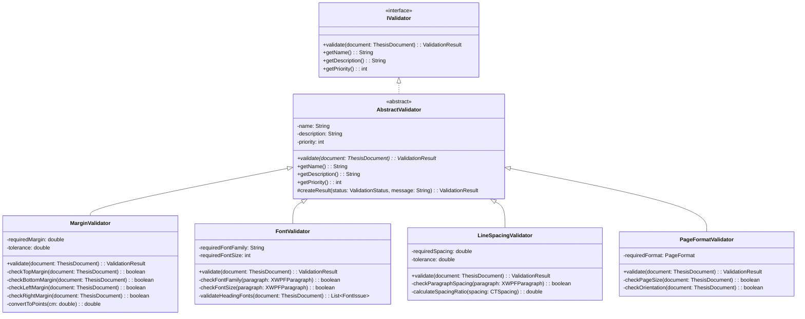
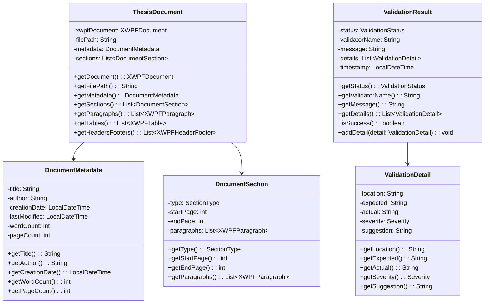
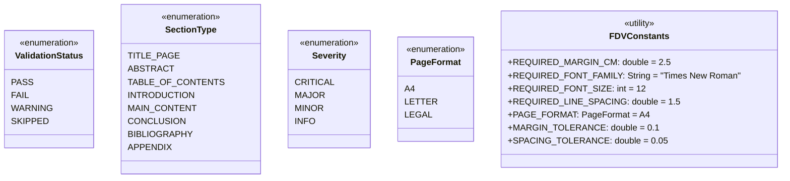
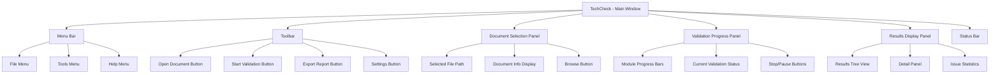
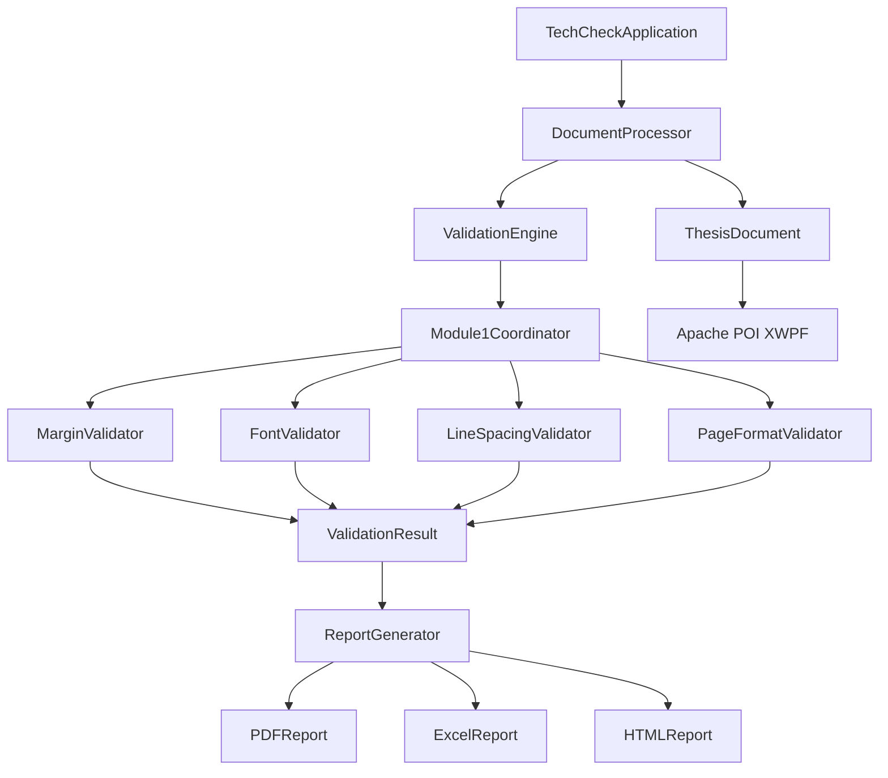
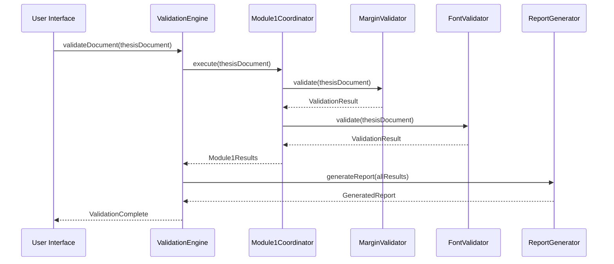

# TechCheck - Module 1 Detailed Design
## Document Structure & Layout Module

---

## 📋 Class Diagram - Module 1: Document Structure & Layout

### Core Classes & Interfaces



### Data Models



### Enums & Constants



---

## 🎨 User Interface Design

### Main Application Window



### UI Component Specifications

#### 1. **Main Window Layout**
```
┌─────────────────────────────────────────────────────────────┐
│ File  Tools  Help                                  [_][□][X] │
├─────────────────────────────────────────────────────────────┤
│ [📁] [▶️] [📊] [⚙️]                                          │
├─────────────────────────────────────────────────────────────┤
│ Document Selection                                          │
│ ┌─────────────────────────────────────────────────────────┐ │
│ │ File: C:\Documents\thesis.docx              [Browse...] │ │
│ │ Pages: 45 | Words: 12,345 | Size: 2.3 MB              │ │
│ └─────────────────────────────────────────────────────────┘ │
├─────────────────────────────────────────────────────────────┤
│ Validation Progress                                         │
│ ┌─────────────────────────────────────────────────────────┐ │
│ │ ✓ Module 1: Document Structure    [████████████] 100%  │ │
│ │ ⚠ Module 2: Content Structure     [██████░░░░░░]  60%  │ │
│ │ ○ Module 3: Tables & Figures      [░░░░░░░░░░░░]   0%  │ │
│ │ ○ Module 4: Citations             [░░░░░░░░░░░░]   0%  │ │
│ │ ○ Module 5: Language & Grammar    [░░░░░░░░░░░░]   0%  │ │
│ │ ○ Module 6: Technical Compliance  [░░░░░░░░░░░░]   0%  │ │
│ └─────────────────────────────────────────────────────────┘ │
├─────────────────────────────────────────────────────────────┤
│ Validation Results                                          │
│ ┌─────────────────────────────────────────────────────────┐ │
│ │ 📋 Document Structure & Layout                          │ │
│ │ ├─ ✓ Margins (2.5cm) - PASS                           │ │
│ │ ├─ ✗ Font Family - FAIL (Arial found, Times required) │ │
│ │ ├─ ⚠ Line Spacing - WARNING (1.4 found, 1.5 required)│ │
│ │ └─ ✓ Page Format (A4) - PASS                          │ │
│ │                                                         │ │
│ │ Details Panel:                                          │ │
│ │ Issue: Font Family Violation                            │ │
│ │ Location: Page 3, Paragraph 12                         │ │
│ │ Expected: Times New Roman, 12pt                        │ │
│ │ Found: Arial, 12pt                                     │ │
│ │ Suggestion: Change font to Times New Roman             │ │
│ └─────────────────────────────────────────────────────────┘ │
├─────────────────────────────────────────────────────────────┤
│ Issues: 2 Critical, 3 Major, 1 Minor | Progress: 16.7%     │
└─────────────────────────────────────────────────────────────┘
```

#### 2. **Settings Dialog**
```
┌─────────────────────────────────────────┐
│ TechCheck Settings                [X]   │
├─────────────────────────────────────────┤
│ [Validation Rules] [General] [Reports]  │
├─────────────────────────────────────────┤
│ Document Structure & Layout             │
│ ┌─────────────────────────────────────┐ │
│ │ ☑ Enable margin validation          │ │
│ │   Margin size: [2.5] cm ±[0.1] cm  │ │
│ │                                     │ │
│ │ ☑ Enable font validation            │ │
│ │   Font family: [Times New Roman ▼] │ │
│ │   Font size: [12] pt ±[0] pt       │ │
│ │                                     │ │
│ │ ☑ Enable line spacing validation    │ │
│ │   Line spacing: [1.5] ±[0.05]      │ │
│ │                                     │ │
│ │ ☑ Enable page format validation     │ │
│ │   Page format: [A4 ▼]              │ │
│ └─────────────────────────────────────┘ │
├─────────────────────────────────────────┤
│              [OK] [Cancel] [Apply]      │
└─────────────────────────────────────────┘
```

#### 3. **Report Export Dialog**
```
┌─────────────────────────────────────────┐
│ Export Validation Report          [X]   │
├─────────────────────────────────────────┤
│ Report Format:                          │
│ ○ PDF Report (Recommended)              │
│ ○ Excel Spreadsheet (.xlsx)             │
│ ○ HTML Report                           │
│ ○ Plain Text (.txt)                     │
│                                         │
│ Include in Report:                      │
│ ☑ Executive Summary                     │
│ ☑ Detailed Findings                     │
│ ☑ Issue Statistics                      │
│ ☑ Recommendations                       │
│ ☑ Technical Details                     │
│                                         │
│ Output Location:                        │
│ [C:\Reports\thesis_review.pdf] [📁]     │
│                                         │
│ ☑ Open report after export              │
├─────────────────────────────────────────┤
│              [Export] [Cancel]          │
└─────────────────────────────────────────┘
```

---

## 🔧 Technical Implementation Details

### Module 1 Validator Specifications

#### **MarginValidator Implementation**
```java
public class MarginValidator extends AbstractValidator {
    
    // Configuration
    private static final double REQUIRED_MARGIN_CM = 2.5;
    private static final double TOLERANCE_CM = 0.1;
    private static final double POINTS_PER_CM = 28.35;
    
    @Override
    public ValidationResult validate(ThesisDocument document) {
        ValidationResult result = new ValidationResult(getName());
        
        // Check each margin type
        checkMargin(document, MarginType.TOP, result);
        checkMargin(document, MarginType.BOTTOM, result);
        checkMargin(document, MarginType.LEFT, result);
        checkMargin(document, MarginType.RIGHT, result);
        
        return result;
    }
    
    private void checkMargin(ThesisDocument document, MarginType type, ValidationResult result) {
        double actualMarginPoints = getMarginValue(document, type);
        double actualMarginCm = actualMarginPoints / POINTS_PER_CM;
        double requiredMarginPoints = REQUIRED_MARGIN_CM * POINTS_PER_CM;
        
        if (Math.abs(actualMarginPoints - requiredMarginPoints) > TOLERANCE_CM * POINTS_PER_CM) {
            ValidationDetail detail = new ValidationDetail(
                String.format("%s margin", type.name()),
                String.format("%.1f cm", REQUIRED_MARGIN_CM),
                String.format("%.1f cm", actualMarginCm),
                Severity.MAJOR,
                String.format("Adjust %s margin to %.1f cm", type.name().toLowerCase(), REQUIRED_MARGIN_CM)
            );
            result.addDetail(detail);
        }
    }
}
```

#### **FontValidator Implementation**
```java
public class FontValidator extends AbstractValidator {
    
    private static final String REQUIRED_FONT_FAMILY = "Times New Roman";
    private static final int REQUIRED_FONT_SIZE = 12;
    
    @Override
    public ValidationResult validate(ThesisDocument document) {
        ValidationResult result = new ValidationResult(getName());
        
        List<XWPFParagraph> paragraphs = document.getParagraphs();
        int paragraphNumber = 1;
        
        for (XWPFParagraph paragraph : paragraphs) {
            validateParagraphFont(paragraph, paragraphNumber, result);
            paragraphNumber++;
        }
        
        return result;
    }
    
    private void validateParagraphFont(XWPFParagraph paragraph, int paragraphNumber, ValidationResult result) {
        List<XWPFRun> runs = paragraph.getRuns();
        
        for (int runIndex = 0; runIndex < runs.size(); runIndex++) {
            XWPFRun run = runs.get(runIndex);
            
            // Check font family
            String fontFamily = run.getFontFamily();
            if (fontFamily != null && !REQUIRED_FONT_FAMILY.equals(fontFamily)) {
                ValidationDetail detail = new ValidationDetail(
                    String.format("Paragraph %d, Run %d", paragraphNumber, runIndex + 1),
                    REQUIRED_FONT_FAMILY,
                    fontFamily,
                    Severity.MAJOR,
                    String.format("Change font to %s", REQUIRED_FONT_FAMILY)
                );
                result.addDetail(detail);
            }
            
            // Check font size
            int fontSize = run.getFontSize();
            if (fontSize != -1 && fontSize != REQUIRED_FONT_SIZE) {
                ValidationDetail detail = new ValidationDetail(
                    String.format("Paragraph %d, Run %d", paragraphNumber, runIndex + 1),
                    String.format("%d pt", REQUIRED_FONT_SIZE),
                    String.format("%d pt", fontSize),
                    Severity.MAJOR,
                    String.format("Change font size to %d pt", REQUIRED_FONT_SIZE)
                );
                result.addDetail(detail);
            }
        }
    }
}
```

### Integration Architecture



---

## 📊 Validation Flow Sequence



---

## 🎯 Success Criteria for Module 1

### **Functional Requirements**
- ✅ **Margin Validation**: Accurately detect margins outside 2.5cm ±0.1cm tolerance
- ✅ **Font Validation**: Identify non-Times New Roman fonts and incorrect sizes
- ✅ **Line Spacing**: Verify 1.5 line spacing with ±0.05 tolerance
- ✅ **Page Format**: Confirm A4 page size and portrait orientation

### **Technical Requirements**
- ✅ **Performance**: Process 100-page document in <30 seconds
- ✅ **Accuracy**: 99%+ accuracy in identifying formatting violations
- ✅ **Error Handling**: Graceful handling of corrupted or protected documents
- ✅ **Reporting**: Clear, actionable feedback with specific locations

### **User Experience Requirements**
- ✅ **Intuitive Interface**: Technical staff can use without training
- ✅ **Progress Feedback**: Real-time validation progress updates
- ✅ **Detailed Results**: Specific locations and recommendations for fixes
- ✅ **Export Options**: Multiple report formats for different stakeholders

---

## 🚀 Next Steps

After completing this detailed design, the next phases will be:

1. **Implementation Preparation**
   - Set up Maven project structure
   - Configure Apache POI dependencies
   - Create base classes and interfaces

2. **Module 1 Development**
   - Implement MarginValidator (highest priority)
   - Develop FontValidator 
   - Create LineSpacingValidator
   - Build PageFormatValidator

3. **Integration & Testing**
   - Unit tests for each validator
   - Integration testing with sample documents
   - Performance optimization

4. **User Interface Implementation**
   - JavaFX UI components
   - Event handling and data binding
   - Report generation and export

This detailed design provides the roadmap for implementing a robust, maintainable, and user-friendly thesis validation system for FDV Ljubljana's technical service staff.