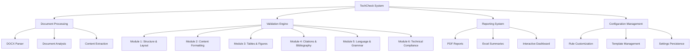
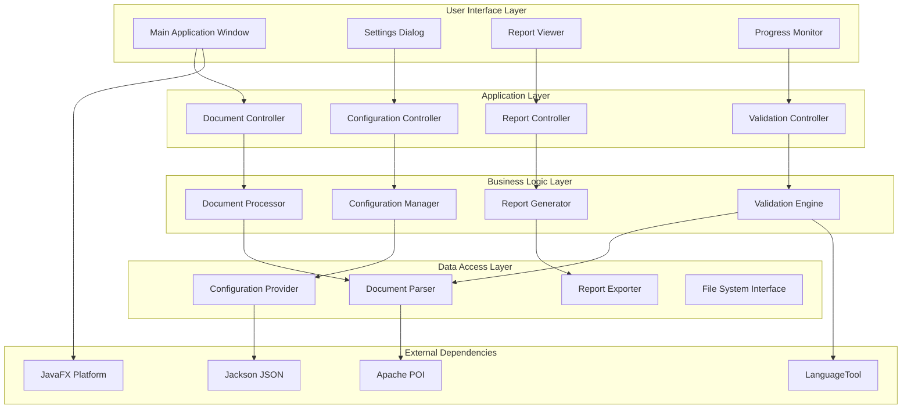

# TechCheck - Complete System Documentation
## Automated Thesis Technical Review System for FDV Ljubljana

---

## 📋 Table of Contents

1. [System Overview](#-system-overview)
2. [Architecture Documentation](#-architecture-documentation)
3. [Installation & Deployment](#-installation--deployment)
4. [Developer Setup Guide](#-developer-setup-guide)
5. [User Manual](#-user-manual)
6. [Configuration Reference](#-configuration-reference)
7. [API Documentation](#-api-documentation)
8. [Maintenance Guide](#-maintenance-guide)
9. [Troubleshooting](#-troubleshooting)
10. [Security & Compliance](#-security--compliance)

---

## 🎯 System Overview

### Project Purpose

TechCheck is an automated thesis technical review system designed specifically for the Faculty of Social Sciences (FDV) at the University of Ljubljana. The system replaces the manual, time-consuming process of checking thesis documents for technical compliance with institutional formatting requirements.

### Key Features

- **Automated Validation**: 6 comprehensive validation modules covering all FDV requirements
- **Modular Architecture**: Clean separation of concerns with extensible validation framework
- **User-Friendly Interface**: JavaFX desktop application designed for technical service staff
- **Flexible Configuration**: Customizable rules and templates for different document types
- **Comprehensive Reporting**: Detailed validation reports with actionable recommendations
- **Performance Optimized**: Handles large documents (500+ pages) efficiently

### System Capabilities



### Technical Specifications

| **Component** | **Technology** | **Version** | **Purpose** |
|---------------|----------------|-------------|-------------|
| **Runtime** | Java | 17+ | Core application platform |
| **UI Framework** | JavaFX | 19+ | Desktop user interface |
| **Document Processing** | Apache POI | 5.2+ | DOCX file parsing and analysis |
| **Grammar Checking** | LanguageTool | 6.0+ | Slovenian language validation |
| **Build System** | Maven | 3.8+ | Dependency management and builds |
| **Testing Framework** | JUnit | 5.9+ | Unit and integration testing |
| **Configuration** | Jackson | 2.15+ | JSON configuration handling |

---

## 🏗️ Architecture Documentation

### High-Level Architecture



### Module Architecture

#### **Module 1: Document Structure & Layout**

```java
// Core interfaces and implementation structure
public interface IValidator<T> {
    ValidationResult validate(T target);
    String getValidatorName();
    ValidationSeverity getSeverity();
}

public abstract class AbstractDocumentValidator implements IValidator<ThesisDocument> {
    protected final ValidationRules rules;
    protected final Logger logger;
    
    protected AbstractDocumentValidator(ValidationRules rules) {
        this.rules = rules;
        this.logger = LoggerFactory.getLogger(this.getClass());
    }
    
    @Override
    public final ValidationResult validate(ThesisDocument document) {
        try {
            logger.debug("Starting validation: {}", getValidatorName());
            return performValidation(document);
        } catch (Exception e) {
            logger.error("Validation failed: " + getValidatorName(), e);
            return ValidationResult.error(e.getMessage());
        }
    }
    
    protected abstract ValidationResult performValidation(ThesisDocument document);
}

// Specific validator implementations
public class MarginValidator extends AbstractDocumentValidator {
    
    @Override
    protected ValidationResult performValidation(ThesisDocument document) {
        MarginSettings marginRules = rules.getDocumentStructureRules().getMarginSettings();
        List<ValidationDetail> issues = new ArrayList<>();
        
        // Top margin validation
        double topMargin = document.getTopMargin();
        if (!isWithinTolerance(topMargin, marginRules.getTopMargin())) {
            issues.add(ValidationDetail.builder()
                .location("Top margin")
                .expected(formatMargin(marginRules.getTopMargin()))
                .actual(formatMargin(topMargin))
                .severity(ValidationSeverity.MAJOR)
                .recommendation("Adjust top margin to " + marginRules.getTopMargin() + " cm")
                .build());
        }
        
        // Similar validation for bottom, left, right margins...
        
        return issues.isEmpty() 
            ? ValidationResult.pass(getValidatorName())
            : ValidationResult.fail(getValidatorName(), issues);
    }
    
    private boolean isWithinTolerance(double actual, double expected) {
        double tolerance = 0.1; // 1mm tolerance
        return Math.abs(actual - expected) <= tolerance;
    }
}
```

#### **Validation Engine Architecture**

```java
public class ValidationEngine {
    
    private final List<IValidationModule> modules;
    private final ExecutorService executorService;
    private final ValidationProgress progressCallback;
    
    public ValidationEngine(ValidationConfiguration config) {
        this.modules = initializeModules(config);
        this.executorService = Executors.newFixedThreadPool(2); // Conservative parallelism
        this.progressCallback = config.getProgressCallback();
    }
    
    public CompletableFuture<ValidationReport> validateDocumentAsync(ThesisDocument document) {
        return CompletableFuture.supplyAsync(() -> {
            ValidationReport.Builder reportBuilder = ValidationReport.builder()
                .documentPath(document.getFilePath())
                .validationTimestamp(Instant.now());
            
            for (int i = 0; i < modules.size(); i++) {
                IValidationModule module = modules.get(i);
                
                // Update progress
                if (progressCallback != null) {
                    progressCallback.updateProgress(i, modules.size(), module.getName());
                }
                
                // Execute module validation
                ModuleResult result = module.validate(document);
                reportBuilder.addModuleResult(result);
                
                // Early termination for critical failures
                if (result.hasCriticalFailures() && shouldStopOnCritical()) {
                    break;
                }
            }
            
            return reportBuilder.build();
        }, executorService);
    }
    
    private List<IValidationModule> initializeModules(ValidationConfiguration config) {
        return Arrays.asList(
            new DocumentStructureModule(config.getDocumentStructureRules()),
            new ContentFormattingModule(config.getContentFormattingRules()),
            new TablesAndFiguresModule(config.getTablesAndFiguresRules()),
            new CitationsModule(config.getCitationRules()),
            new LanguageModule(config.getLanguageRules()),
            new TechnicalComplianceModule(config.getTechnicalRules())
        );
    }
}
```

### Data Models

#### **Core Document Model**

```java
public class ThesisDocument {
    
    private final Path filePath;
    private final XWPFDocument xwpfDocument;
    private final DocumentMetadata metadata;
    private final List<DocumentSection> sections;
    private final PageSettings pageSettings;
    
    // Constructor, getters, and utility methods
    
    public static class Builder {
        private Path filePath;
        private XWPFDocument xwpfDocument;
        private DocumentMetadata metadata;
        
        public Builder filePath(Path filePath) {
            this.filePath = filePath;
            return this;
        }
        
        public Builder xwpfDocument(XWPFDocument document) {
            this.xwpfDocument = document;
            return this;
        }
        
        public ThesisDocument build() {
            return new ThesisDocument(this);
        }
    }
    
    // Document analysis methods
    public double getTopMargin() {
        CTSectPr sectPr = xwpfDocument.getDocument().getBody().getSectPr();
        if (sectPr != null && sectPr.getPgMar() != null) {
            return convertTwipsToPoints(sectPr.getPgMar().getTop().intValue());
        }
        return 0.0;
    }
    
    public List<XWPFParagraph> getParagraphs() {
        return xwpfDocument.getParagraphs();
    }
    
    public List<XWPFTable> getTables() {
        return xwpfDocument.getTables();
    }
    
    // Utility methods for document analysis
    private double convertTwipsToPoints(int twips) {
        return twips / 20.0; // 1 point = 20 twips
    }
}
```

#### **Validation Result Models**

```java
public class ValidationResult {
    
    private final ValidationStatus status;
    private final String validatorName;
    private final List<ValidationDetail> details;
    private final Instant timestamp;
    private final Duration processingTime;
    
    public enum ValidationStatus {
        PASS, FAIL, WARNING, ERROR, SKIP
    }
    
    // Factory methods
    public static ValidationResult pass(String validatorName) {
        return new ValidationResult(ValidationStatus.PASS, validatorName, 
                                  Collections.emptyList(), Instant.now(), Duration.ZERO);
    }
    
    public static ValidationResult fail(String validatorName, List<ValidationDetail> details) {
        return new ValidationResult(ValidationStatus.FAIL, validatorName, 
                                  details, Instant.now(), Duration.ZERO);
    }
    
    // Analysis methods
    public boolean hasIssues() {
        return status == ValidationStatus.FAIL || status == ValidationStatus.WARNING;
    }
    
    public long getCriticalIssueCount() {
        return details.stream()
                .filter(detail -> detail.getSeverity() == ValidationSeverity.CRITICAL)
                .count();
    }
}

public class ValidationDetail {
    
    private final String location;
    private final String expected;
    private final String actual;
    private final ValidationSeverity severity;
    private final String recommendation;
    private final String ruleReference;
    
    public enum ValidationSeverity {
        CRITICAL, MAJOR, MINOR, INFO
    }
    
    // Builder pattern implementation
    public static class Builder {
        // Builder implementation...
    }
}
```

---

## 🚀 Installation & Deployment

### System Requirements

#### **Minimum Requirements**
- **Operating System**: Windows 10+, macOS 10.14+, Ubuntu 18.04+
- **Java Runtime**: OpenJDK 17+ or Oracle JDK 17+
- **Memory**: 4 GB RAM
- **Storage**: 500 MB available space
- **Display**: 1280x720 resolution

#### **Recommended Requirements**
- **Operating System**: Windows 11, macOS 12+, Ubuntu 20.04+
- **Java Runtime**: OpenJDK 21+ or Oracle JDK 21+
- **Memory**: 8 GB RAM
- **Storage**: 2 GB available space
- **Display**: 1920x1080 resolution

### Installation Steps

#### **1. Java Installation**

```bash
# Ubuntu/Debian
sudo apt update
sudo apt install openjdk-17-jdk

# macOS (using Homebrew)
brew install openjdk@17

# Windows
# Download OpenJDK from https://adoptium.net/ and follow installer
```

#### **2. TechCheck Installation**

```bash
# Download TechCheck distribution
wget https://github.com/fdv-ljubljana/techcheck/releases/latest/techcheck-1.0.0.zip

# Extract distribution
unzip techcheck-1.0.0.zip
cd techcheck-1.0.0

# Make startup script executable (Linux/macOS)
chmod +x bin/techcheck

# Run TechCheck
./bin/techcheck                    # Linux/macOS
bin\techcheck.bat                  # Windows
```

#### **3. Configuration Setup**

```bash
# Create configuration directory
mkdir -p ~/.techcheck/config

# Copy default configuration
cp config/default-config.json ~/.techcheck/config/techcheck-config.json

# Edit configuration for your institution
nano ~/.techcheck/config/techcheck-config.json
```

### Docker Deployment

```dockerfile
# Dockerfile for TechCheck
FROM openjdk:17-jdk-slim

LABEL maintainer="FDV Ljubljana Technical Team"

# Install required packages
RUN apt-get update && apt-get install -y \
    libxrender1 \
    libxtst6 \
    libxi6 \
    libgl1-mesa-glx \
    libgtk-3-0 \
    && rm -rf /var/lib/apt/lists/*

# Create application directory
WORKDIR /app

# Copy application files
COPY target/techcheck-*.jar techcheck.jar
COPY config/ config/
COPY scripts/ scripts/

# Create non-root user
RUN groupadd -r techcheck && useradd -r -g techcheck techcheck
RUN chown -R techcheck:techcheck /app
USER techcheck

# Expose application port (if running web interface)
EXPOSE 8080

# Health check
HEALTHCHECK --interval=30s --timeout=10s --start-period=60s --retries=3 \
    CMD java -cp techcheck.jar com.fdv.techcheck.HealthCheck

# Start application
ENTRYPOINT ["java", "-jar", "techcheck.jar"]
```

```yaml
# docker-compose.yml for development
version: '3.8'

services:
  techcheck:
    build: .
    container_name: techcheck-app
    ports:
      - "8080:8080"
    volumes:
      - ./config:/app/config
      - ./data:/app/data
      - ./logs:/app/logs
    environment:
      - JAVA_OPTS=-Xmx2g -Xms1g
      - TECHCHECK_CONFIG=/app/config/techcheck-config.json
    networks:
      - techcheck-network

networks:
  techcheck-network:
    driver: bridge
```

---

## 💻 Developer Setup Guide

### Development Environment Setup

#### **1. Prerequisites Installation**

```bash
# Install Java 17+
sudo apt install openjdk-17-jdk

# Install Maven 3.8+
sudo apt install maven

# Install Git
sudo apt install git

# Verify installations
java -version
mvn -version
git --version
```

#### **2. Project Clone and Setup**

```bash
# Clone repository
git clone https://github.com/fdv-ljubljana/techcheck.git
cd techcheck

# Install dependencies
mvn clean install

# Run tests
mvn test

# Start development server
mvn javafx:run
```

#### **3. IDE Configuration**

**IntelliJ IDEA Setup:**

```xml
<!-- .idea/runConfigurations/TechCheck_Development.xml -->
<component name="ProjectRunConfigurationManager">
  <configuration default="false" name="TechCheck Development" type="MavenRunConfiguration">
    <MavenSettings>
      <option name="myGeneralSettings" />
      <option name="myRunnerSettings" />
      <option name="myRunnerParameters">
        <MavenRunnerParameters>
          <option name="goals">
            <list>
              <option value="clean" />
              <option value="javafx:run" />
            </list>
          </option>
          <option name="profilesMap">
            <map />
          </option>
          <option name="projectsCmdOptionValues">
            <list />
          </option>
          <option name="resolveToWorkspace" value="false" />
          <option name="workingDirPath" value="$PROJECT_DIR$" />
        </MavenRunnerParameters>
      </option>
    </MavenSettings>
    <method v="2" />
  </configuration>
</component>
```

**VS Code Setup:**

```json
// .vscode/launch.json
{
    "version": "0.2.0",
    "configurations": [
        {
            "type": "java",
            "name": "Launch TechCheck",
            "request": "launch",
            "mainClass": "com.fdv.techcheck.TechCheckApplication",
            "projectName": "techcheck",
            "args": [],
            "vmArgs": [
                "--module-path", "/path/to/javafx/lib",
                "--add-modules", "javafx.controls,javafx.fxml"
            ]
        }
    ]
}
```

### Development Workflow

#### **1. Branch Strategy**

```bash
# Feature development workflow
git checkout -b feature/margin-validator-improvements
# Make changes
git add .
git commit -m "feat: improve margin tolerance handling"
git push origin feature/margin-validator-improvements
# Create pull request
```

#### **2. Code Quality Checks**

```bash
# Run code formatting
mvn spotless:apply

# Run static analysis
mvn spotbugs:check
mvn checkstyle:check

# Run security scanning
mvn org.owasp:dependency-check-maven:check

# Run all quality gates
mvn clean verify
```

#### **3. Testing During Development**

```bash
# Run specific test class
mvn test -Dtest=MarginValidatorTest

# Run tests with coverage
mvn test jacoco:report

# Run integration tests
mvn verify -P integration-tests

# Run performance tests
mvn test -P performance-tests
```

### Build and Packaging

#### **1. Build Configuration**

```xml
<!-- pom.xml - Key build sections -->
<properties>
    <maven.compiler.source>17</maven.compiler.source>
    <maven.compiler.target>17</maven.compiler.target>
    <javafx.version>19.0.2.1</javafx.version>
    <poi.version>5.2.4</poi.version>
    <languagetool.version>6.0</languagetool.version>
    <junit.version>5.9.3</junit.version>
</properties>

<dependencies>
    <!-- JavaFX -->
    <dependency>
        <groupId>org.openjfx</groupId>
        <artifactId>javafx-controls</artifactId>
        <version>${javafx.version}</version>
    </dependency>
    
    <!-- Apache POI for DOCX processing -->
    <dependency>
        <groupId>org.apache.poi</groupId>
        <artifactId>poi-ooxml</artifactId>
        <version>${poi.version}</version>
    </dependency>
    
    <!-- LanguageTool for grammar checking -->
    <dependency>
        <groupId>org.languagetool</groupId>
        <artifactId>language-sl</artifactId>
        <version>${languagetool.version}</version>
    </dependency>
</dependencies>
```

#### **2. Build Commands**

```bash
# Clean build
mvn clean compile

# Build with tests
mvn clean package

# Build without tests (for CI)
mvn clean package -DskipTests

# Build distribution
mvn clean package assembly:single

# Build native installer
mvn clean package -P native-installer
```

#### **3. Release Process**

```bash
# Prepare release
mvn release:prepare

# Perform release
mvn release:perform

# Create GitHub release
gh release create v1.0.0 \
    --title "TechCheck v1.0.0" \
    --notes "Initial release of TechCheck automated thesis validation system" \
    target/techcheck-1.0.0-distribution.zip
```

---

## 👥 User Manual

### Getting Started

#### **First Time Setup**

1. **Launch TechCheck**
   - Double-click the TechCheck icon
   - Or run from command line: `./bin/techcheck`

2. **Initial Configuration**
   - Click "Settings" in the main menu
   - Review and adjust validation rules as needed
   - Click "Save" to apply settings

3. **Load Your First Document**
   - Click "Browse" button
   - Select a DOCX thesis file
   - Click "Start Validation"

#### **Main Interface Overview**

```
┌─────────────────────────────────────────────────────────────┐
│ File  Edit  Settings  Help                              ×   │
├─────────────────────────────────────────────────────────────┤
│                                                             │
│ Document: [Browse...] [thesis-document.docx        ]       │
│                                                             │
│ ┌─ Validation Progress ─────────────────────────────────┐   │
│ │ Current: Module 2 - Content Formatting             │   │
│ │ Progress: ████████████████████░░░░░░ 75%           │   │
│ │ Time: 00:45 / ~01:00                               │   │
│ └───────────────────────────────────────────────────────┘   │
│                                                             │
│ ┌─ Validation Results ──────────────────────────────────┐   │
│ │ ✅ Module 1: Document Structure & Layout           │   │
│ │ ⏳ Module 2: Content Formatting (In Progress...)   │   │
│ │ ⌛ Module 3: Tables & Figures (Pending)            │   │
│ │ ⌛ Module 4: Citations & Bibliography (Pending)     │   │
│ │ ⌛ Module 5: Language & Grammar (Pending)           │   │
│ │ ⌛ Module 6: Technical Compliance (Pending)         │   │
│ └───────────────────────────────────────────────────────┘   │
│                                                             │
│                    [Start Validation] [Export Report]      │
│                                                             │
└─────────────────────────────────────────────────────────────┘
```

### Daily Workflow

#### **1. Document Validation Process**

1. **Load Document**
   ```
   File > Open Document (Ctrl+O)
   Navigate to thesis document
   Select DOCX file
   ```

2. **Review Settings** (Optional)
   ```
   Settings > Validation Rules
   Check margin requirements (default: 2.5cm)
   Verify font settings (default: Times New Roman 12pt)
   Confirm line spacing (default: 1.5)
   ```

3. **Start Validation**
   ```
   Click "Start Validation"
   Monitor progress in real-time
   Wait for completion (~1-2 minutes for typical thesis)
   ```

4. **Review Results**
   ```
   Check module status indicators
   Expand failed modules for details
   Review specific issue locations
   Note severity levels (Critical, Major, Minor, Info)
   ```

5. **Export Report**
   ```
   Click "Export Report"
   Choose format (PDF, Excel, HTML)
   Save to desired location
   Share with student/faculty as needed
   ```

#### **2. Batch Processing Multiple Documents**

```python
# Batch processing workflow
documents = [
    "thesis-student-001.docx",
    "thesis-student-002.docx", 
    "thesis-student-003.docx"
]

for document in documents:
    # Load document
    # Run validation
    # Export report
    # Move to next document
```

### Advanced Features

#### **1. Custom Validation Rules**

**Adjusting Margin Requirements:**
```
Settings > Document Structure > Margins
Top Margin: 2.5 cm (±0.1 cm tolerance)
Bottom Margin: 2.5 cm (±0.1 cm tolerance)
Left Margin: 3.0 cm (±0.1 cm tolerance)    # Different for binding
Right Margin: 2.5 cm (±0.1 cm tolerance)
```

**Font Configuration:**
```
Settings > Document Structure > Typography
Primary Font: Times New Roman
Primary Size: 12 pt
Heading Font: Times New Roman
Heading Sizes: H1=16pt, H2=14pt, H3=12pt
Allow Bold: Yes (for headings only)
Allow Italic: Yes (for emphasis)
```

#### **2. Report Customization**

**Report Template Selection:**
```
Settings > Reporting > Template
□ Standard Report (default)
□ Detailed Technical Report
□ Summary Report (for faculty)
□ Student-Friendly Report
```

**Report Content Options:**
```
Settings > Reporting > Content
☑ Executive Summary
☑ Module-by-Module Results  
☑ Issue Location References
☑ Severity Classifications
☑ Recommendations
☑ Before/After Comparisons
☐ Technical Details (debug info)
```

### Troubleshooting Common Issues

#### **1. Document Loading Problems**

**Issue: "Cannot open document"**
```
Solution:
1. Verify file is .docx format (not .doc or .pdf)
2. Check file is not password protected
3. Ensure file is not corrupted
4. Try opening in Microsoft Word first
```

**Issue: "Document appears empty"**
```
Solution: 
1. Check if document has hidden content
2. Verify document contains actual text (not just images)
3. Check if document uses non-standard formatting
```

#### **2. Validation Errors**

**Issue: "Validation failed unexpectedly"**
```
Solution:
1. Check error log (Help > View Logs)
2. Restart TechCheck application
3. Try with a known-good document
4. Contact technical support
```

**Issue: "Grammar check not working"**
```
Solution:
1. Verify LanguageTool installation
2. Check internet connection (for some features)
3. Restart application
4. Reinstall LanguageTool component
```

#### **3. Performance Issues**

**Issue: "Validation taking too long"**
```
Solution:
1. Close other applications to free memory
2. Check document size (>500 pages may be slow)
3. Disable non-essential validation modules temporarily
4. Consider upgrading system RAM
```

---

## ⚙️ Configuration Reference

### Configuration File Structure

```json
{
  "version": "1.0.0",
  "lastModified": "2024-03-15T10:30:00Z",
  "institution": {
    "name": "Faculty of Social Sciences",
    "abbreviation": "FDV",
    "university": "University of Ljubljana",
    "country": "Slovenia"
  },
  "validationRules": {
    "documentStructureRules": {
      "marginSettings": {
        "topMargin": 2.5,
        "bottomMargin": 2.5,
        "leftMargin": 2.5,
        "rightMargin": 2.5,
        "tolerance": 0.1,
        "unit": "cm"
      },
      "fontSettings": {
        "primaryFont": "Times New Roman",
        "primarySize": 12,
        "headingFont": "Times New Roman",
        "headingSizes": {
          "h1": 16,
          "h2": 14,
          "h3": 12,
          "h4": 12,
          "h5": 10,
          "h6": 10
        },
        "allowBold": true,
        "allowItalic": true,
        "allowUnderline": false
      },
      "spacingSettings": {
        "lineSpacing": 1.5,
        "paragraphSpacingBefore": 0,
        "paragraphSpacingAfter": 6,
        "tolerance": 0.1
      },
      "pageSettings": {
        "pageSize": "A4",
        "orientation": "portrait",
        "pageNumbering": true,
        "pageNumberPosition": "bottom-center"
      }
    },
    "contentFormattingRules": {
      "headingRules": {
        "requireNumbering": true,
        "numberingStyle": "1. 1.1 1.1.1",
        "maxDepth": 4,
        "enforceHierarchy": true
      },
      "paragraphRules": {
        "minLength": 50,
        "maxLength": 2000,
        "requireIndentation": false,
        "indentationSize": 0
      },
      "listRules": {
        "bulletStyle": "•",
        "numberedStyle": "1. a. i.",
        "maxNestingLevel": 3
      }
    },
    "tablesAndFiguresRules": {
      "tableRules": {
        "requireCaptions": true,
        "captionPosition": "above",
        "requireNumbering": true,
        "numberingPrefix": "Table",
        "centerAlignment": true
      },
      "figureRules": {
        "requireCaptions": true,
        "captionPosition": "below", 
        "requireNumbering": true,
        "numberingPrefix": "Figure",
        "centerAlignment": true,
        "maxWidth": "100%"
      }
    },
    "citationRules": {
      "citationStyle": "APA",
      "inTextFormat": "(Author, Year)",
      "requirePageNumbers": false,
      "bibliographyTitle": "Bibliography",
      "sortOrder": "alphabetical"
    },
    "languageRules": {
      "primaryLanguage": "sl-SI",
      "enableSpellCheck": true,
      "enableGrammarCheck": true,
      "customDictionary": [],
      "languageToolEnabled": true
    },
    "technicalComplianceRules": {
      "wordCountMin": 15000,
      "wordCountMax": 25000,
      "pageCountMin": 30,
      "pageCountMax": 80,
      "requireAbstract": true,
      "requireKeywords": true,
      "requireTableOfContents": true,
      "requireBibliography": true
    }
  },
  "reportingSettings": {
    "defaultFormat": "PDF",
    "includeTimestamp": true,
    "includeTechnicalDetails": false,
    "template": "standard",
    "logo": "fdv-logo.png",
    "contactInfo": {
      "department": "Technical Services",
      "email": "technical@fdv.uni-lj.si",
      "phone": "+386 1 580 5300"
    }
  },
  "applicationSettings": {
    "uiTheme": "light",
    "language": "sl-SI",
    "autoSave": true,
    "autoSaveInterval": 300,
    "maxRecentDocuments": 10,
    "enableLogging": true,
    "logLevel": "INFO"
  }
}
```

### Configuration Templates

#### **Template 1: Bachelor Thesis**
```json
{
  "templateName": "Bachelor Thesis - FDV",
  "validationRules": {
    "technicalComplianceRules": {
      "wordCountMin": 8000,
      "wordCountMax": 15000,
      "pageCountMin": 20,
      "pageCountMax": 50
    }
  }
}
```

#### **Template 2: Master Thesis**
```json
{
  "templateName": "Master Thesis - FDV", 
  "validationRules": {
    "technicalComplianceRules": {
      "wordCountMin": 15000,
      "wordCountMax": 25000,
      "pageCountMin": 40,
      "pageCountMax": 80
    }
  }
}
```

#### **Template 3: Doctoral Dissertation**
```json
{
  "templateName": "Doctoral Dissertation - FDV",
  "validationRules": {
    "technicalComplianceRules": {
      "wordCountMin": 40000,
      "wordCountMax": 100000,
      "pageCountMin": 100,
      "pageCountMax": 300
    }
  }
}
```

---

## 📚 API Documentation

### Core Validation API

#### **ValidationEngine Class**

```java
/**
 * Main validation engine that coordinates all validation modules.
 * Provides both synchronous and asynchronous validation capabilities.
 */
public class ValidationEngine {
    
    /**
     * Validates a thesis document against all configured rules.
     * 
     * @param document The thesis document to validate
     * @return Complete validation report with all module results
     * @throws ValidationException if validation cannot be completed
     */
    public ValidationReport validateDocument(ThesisDocument document) 
            throws ValidationException;
    
    /**
     * Validates a document asynchronously with progress reporting.
     * 
     * @param document The thesis document to validate
     * @param progressCallback Callback for progress updates
     * @return Future containing the validation report
     */
    public CompletableFuture<ValidationReport> validateDocumentAsync(
            ThesisDocument document, 
            ValidationProgressCallback progressCallback);
    
    /**
     * Validates only specific modules.
     * 
     * @param document The thesis document to validate
     * @param moduleNames List of module names to execute
     * @return Partial validation report
     */
    public ValidationReport validateModules(ThesisDocument document, 
                                          List<String> moduleNames);
}
```

#### **Document Processing API**

```java
/**
 * Document processor for loading and analyzing DOCX files.
 */
public class DocumentProcessor {
    
    /**
     * Loads a DOCX document for validation.
     * 
     * @param filePath Path to the DOCX file
     * @return Parsed thesis document ready for validation
     * @throws DocumentProcessingException if file cannot be processed
     */
    public static ThesisDocument loadDocument(Path filePath) 
            throws DocumentProcessingException;
    
    /**
     * Extracts metadata from a document.
     * 
     * @param document The document to analyze
     * @return Document metadata including word count, page count, etc.
     */
    public DocumentMetadata extractMetadata(ThesisDocument document);
    
    /**
     * Analyzes document structure and creates section hierarchy.
     * 
     * @param document The document to analyze
     * @return List of document sections with hierarchy information
     */
    public List<DocumentSection> analyzeStructure(ThesisDocument document);
}
```

### Configuration API

#### **Configuration Management**

```java
/**
 * Configuration manager for loading and saving validation rules.
 */
public class ConfigurationManager {
    
    /**
     * Loads configuration from the default location.
     * 
     * @return Current configuration settings
     * @throws ConfigurationException if configuration cannot be loaded
     */
    public TechCheckConfig loadConfiguration() throws ConfigurationException;
    
    /**
     * Saves configuration to the default location.
     * 
     * @param config Configuration to save
     * @throws ConfigurationException if configuration cannot be saved
     */
    public void saveConfiguration(TechCheckConfig config) 
            throws ConfigurationException;
    
    /**
     * Validates configuration for consistency and correctness.
     * 
     * @param config Configuration to validate
     * @return List of validation issues found
     */
    public List<ConfigurationIssue> validateConfiguration(TechCheckConfig config);
    
    /**
     * Creates a new configuration from a template.
     * 
     * @param templateName Name of the template to use
     * @return New configuration based on template
     */
    public TechCheckConfig createFromTemplate(String templateName);
}
```

### Reporting API

#### **Report Generation**

```java
/**
 * Report generator for creating validation reports in various formats.
 */
public class ReportGenerator {
    
    /**
     * Generates a PDF report from validation results.
     * 
     * @param report Validation report data
     * @param outputPath Where to save the PDF
     * @throws ReportGenerationException if report cannot be created
     */
    public void generatePdfReport(ValidationReport report, Path outputPath) 
            throws ReportGenerationException;
    
    /**
     * Generates an Excel summary report.
     * 
     * @param report Validation report data
     * @param outputPath Where to save the Excel file
     * @throws ReportGenerationException if report cannot be created
     */
    public void generateExcelReport(ValidationReport report, Path outputPath) 
            throws ReportGenerationException;
    
    /**
     * Generates an HTML report for web viewing.
     * 
     * @param report Validation report data
     * @param outputPath Where to save the HTML file
     * @throws ReportGenerationException if report cannot be created
     */
    public void generateHtmlReport(ValidationReport report, Path outputPath) 
            throws ReportGenerationException;
}
```

### Extension API

#### **Custom Validator Development**

```java
/**
 * Base class for implementing custom validators.
 * Extend this class to create institution-specific validation rules.
 */
public abstract class CustomValidator implements IValidator<ThesisDocument> {
    
    protected final String validatorName;
    protected final ValidationSeverity defaultSeverity;
    
    protected CustomValidator(String validatorName, ValidationSeverity severity) {
        this.validatorName = validatorName;
        this.defaultSeverity = severity;
    }
    
    /**
     * Implement this method with your custom validation logic.
     * 
     * @param document The document to validate
     * @return Validation result with any issues found
     */
    @Override
    public abstract ValidationResult validate(ThesisDocument document);
    
    /**
     * Helper method for creating validation details.
     * 
     * @param location Where the issue was found
     * @param expected What was expected
     * @param actual What was found
     * @param recommendation Suggested fix
     * @return Validation detail object
     */
    protected ValidationDetail createDetail(String location, String expected, 
                                          String actual, String recommendation) {
        return ValidationDetail.builder()
                .location(location)
                .expected(expected)
                .actual(actual)
                .severity(defaultSeverity)
                .recommendation(recommendation)
                .build();
    }
}

// Example custom validator implementation
public class InstitutionSpecificValidator extends CustomValidator {
    
    public InstitutionSpecificValidator() {
        super("Institution Logo Validator", ValidationSeverity.MINOR);
    }
    
    @Override
    public ValidationResult validate(ThesisDocument document) {
        // Check for required institutional logo on title page
        List<ValidationDetail> issues = new ArrayList<>();
        
        if (!hasInstitutionLogo(document)) {
            issues.add(createDetail(
                "Title page",
                "Institution logo present", 
                "No logo found",
                "Add institution logo to title page"
            ));
        }
        
        return issues.isEmpty() 
            ? ValidationResult.pass(validatorName)
            : ValidationResult.fail(validatorName, issues);
    }
    
    private boolean hasInstitutionLogo(ThesisDocument document) {
        // Implementation logic for logo detection
        return false;
    }
}
```

---

## 🔧 Maintenance Guide

### Regular Maintenance Tasks

#### **Daily Tasks**
- Monitor application logs for errors
- Check system resource usage
- Verify backup processes completed
- Review user feedback and issue reports

#### **Weekly Tasks**
- Update virus definitions (if applicable)
- Review and archive old log files
- Check disk space usage
- Test backup restoration process

#### **Monthly Tasks**
- Update dependencies to latest stable versions
- Review and update configuration templates
- Perform comprehensive system testing
- Update documentation as needed

#### **Quarterly Tasks**
- Security audit and vulnerability assessment
- Performance optimization review
- User training session planning
- System architecture review

### Update and Upgrade Procedures

#### **Application Updates**

```bash
# 1. Backup current installation
cp -r /opt/techcheck /opt/techcheck-backup-$(date +%Y%m%d)

# 2. Download new version
wget https://github.com/fdv-ljubljana/techcheck/releases/latest/techcheck-${NEW_VERSION}.zip

# 3. Stop application (if running as service)
sudo systemctl stop techcheck

# 4. Extract new version
unzip techcheck-${NEW_VERSION}.zip -d /opt/

# 5. Migrate configuration
cp /opt/techcheck-backup-*/config/* /opt/techcheck/config/

# 6. Start application
sudo systemctl start techcheck

# 7. Verify functionality
./scripts/health-check.sh

# 8. Remove backup if successful
rm -rf /opt/techcheck-backup-*
```

#### **Dependency Updates**

```bash
# Update Maven dependencies
mvn versions:display-dependency-updates
mvn versions:use-latest-versions

# Update JavaFX
mvn versions:set-property -Dproperty=javafx.version -DnewVersion=20.0.1

# Update Apache POI
mvn versions:set-property -Dproperty=poi.version -DnewVersion=5.2.5

# Test with new dependencies
mvn clean test
```

### Monitoring and Logging

#### **Log Configuration**

```xml
<!-- logback.xml -->
<configuration>
    <appender name="FILE" class="ch.qos.logback.core.rolling.RollingFileAppender">
        <file>logs/techcheck.log</file>
        <rollingPolicy class="ch.qos.logback.core.rolling.TimeBasedRollingPolicy">
            <fileNamePattern>logs/techcheck.%d{yyyy-MM-dd}.%i.gz</fileNamePattern>
            <maxFileSize>10MB</maxFileSize>
            <maxHistory>30</maxHistory>
            <totalSizeCap>1GB</totalSizeCap>
        </rollingPolicy>
        <encoder>
            <pattern>%d{HH:mm:ss.SSS} [%thread] %-5level %logger{36} - %msg%n</pattern>
        </encoder>
    </appender>
    
    <appender name="CONSOLE" class="ch.qos.logback.core.ConsoleAppender">
        <encoder>
            <pattern>%d{HH:mm:ss.SSS} [%thread] %-5level %logger{36} - %msg%n</pattern>
        </encoder>
    </appender>
    
    <logger name="com.fdv.techcheck" level="INFO" />
    <logger name="org.apache.poi" level="WARN" />
    <logger name="org.languagetool" level="WARN" />
    
    <root level="INFO">
        <appender-ref ref="FILE" />
        <appender-ref ref="CONSOLE" />
    </root>
</configuration>
```

#### **Health Monitoring**

```java
/**
 * Health check component for monitoring system status.
 */
@Component
public class HealthMonitor {
    
    private static final Logger logger = LoggerFactory.getLogger(HealthMonitor.class);
    
    /**
     * Performs comprehensive health check.
     * 
     * @return Health status report
     */
    public HealthStatus checkSystemHealth() {
        HealthStatus.Builder status = HealthStatus.builder();
        
        // Check memory usage
        Runtime runtime = Runtime.getRuntime();
        long totalMemory = runtime.totalMemory();
        long freeMemory = runtime.freeMemory();
        double memoryUsage = (double)(totalMemory - freeMemory) / totalMemory;
        
        status.memoryUsage(memoryUsage);
        if (memoryUsage > 0.8) {
            status.addWarning("High memory usage: " + (memoryUsage * 100) + "%");
        }
        
        // Check disk space
        Path logDir = Paths.get("logs");
        try {
            FileStore store = Files.getFileStore(logDir);
            long totalSpace = store.getTotalSpace();
            long usableSpace = store.getUsableSpace();
            double diskUsage = (double)(totalSpace - usableSpace) / totalSpace;
            
            status.diskUsage(diskUsage);
            if (diskUsage > 0.9) {
                status.addError("Low disk space: " + (usableSpace / 1024 / 1024) + " MB remaining");
            }
        } catch (IOException e) {
            status.addError("Cannot check disk space: " + e.getMessage());
        }
        
        // Check configuration validity
        try {
            ConfigurationManager configManager = new ConfigurationManager();
            TechCheckConfig config = configManager.loadConfiguration();
            List<ConfigurationIssue> issues = configManager.validateConfiguration(config);
            
            if (!issues.isEmpty()) {
                status.addWarning("Configuration issues found: " + issues.size());
            }
        } catch (Exception e) {
            status.addError("Configuration check failed: " + e.getMessage());
        }
        
        return status.build();
    }
    
    /**
     * Scheduled health check that runs every 15 minutes.
     */
    @Scheduled(fixedRate = 900000) // 15 minutes
    public void scheduledHealthCheck() {
        HealthStatus status = checkSystemHealth();
        
        if (status.hasErrors()) {
            logger.error("Health check failed: {}", status.getErrors());
        } else if (status.hasWarnings()) {
            logger.warn("Health check warnings: {}", status.getWarnings());
        } else {
            logger.debug("Health check passed");
        }
    }
}
```

### Backup and Recovery

#### **Backup Strategy**

```bash
#!/bin/bash
# backup-techcheck.sh

BACKUP_DIR="/opt/backups/techcheck"
TIMESTAMP=$(date +%Y%m%d_%H%M%S)
BACKUP_NAME="techcheck-backup-${TIMESTAMP}"

# Create backup directory
mkdir -p ${BACKUP_DIR}

# Backup configuration files
tar -czf ${BACKUP_DIR}/${BACKUP_NAME}-config.tar.gz \
    /opt/techcheck/config/ \
    ~/.techcheck/

# Backup application data
tar -czf ${BACKUP_DIR}/${BACKUP_NAME}-data.tar.gz \
    /opt/techcheck/data/ \
    /opt/techcheck/logs/

# Backup database (if applicable)
# pg_dump techcheck > ${BACKUP_DIR}/${BACKUP_NAME}-database.sql

# Clean old backups (keep last 30 days)
find ${BACKUP_DIR} -name "techcheck-backup-*" -mtime +30 -delete

echo "Backup completed: ${BACKUP_NAME}"
```

#### **Recovery Procedures**

```bash
#!/bin/bash
# restore-techcheck.sh

if [ $# -ne 1 ]; then
    echo "Usage: $0 <backup-timestamp>"
    echo "Example: $0 20240315_143000"
    exit 1
fi

BACKUP_TIMESTAMP=$1
BACKUP_DIR="/opt/backups/techcheck"

# Stop application
sudo systemctl stop techcheck

# Restore configuration
tar -xzf ${BACKUP_DIR}/techcheck-backup-${BACKUP_TIMESTAMP}-config.tar.gz -C /

# Restore data
tar -xzf ${BACKUP_DIR}/techcheck-backup-${BACKUP_TIMESTAMP}-data.tar.gz -C /

# Restore database (if applicable)
# psql techcheck < ${BACKUP_DIR}/techcheck-backup-${BACKUP_TIMESTAMP}-database.sql

# Start application
sudo systemctl start techcheck

# Verify restoration
sleep 10
./scripts/health-check.sh

echo "Restoration completed from backup: ${BACKUP_TIMESTAMP}"
```

---

## 🔍 Troubleshooting

### Common Issues and Solutions

#### **Issue 1: Application Won't Start**

**Symptoms:**
- Double-clicking icon does nothing
- Command line shows Java errors
- "Module not found" errors

**Diagnosis Steps:**
```bash
# Check Java installation
java -version

# Check JavaFX availability
java --list-modules | grep javafx

# Check application jar
jar -tf techcheck.jar | head -10

# Check for missing dependencies
ldd techcheck (Linux)
otool -L techcheck (macOS)
```

**Solutions:**
```bash
# Install correct Java version
sudo apt install openjdk-17-jdk

# Install JavaFX separately if needed
sudo apt install openjfx

# Set JAVA_HOME environment variable
export JAVA_HOME=/usr/lib/jvm/java-17-openjdk-amd64

# Run with explicit module path
java --module-path /usr/share/openjfx/lib \
     --add-modules javafx.controls,javafx.fxml \
     -jar techcheck.jar
```

#### **Issue 2: Document Processing Failures**

**Symptoms:**
- "Cannot open document" errors
- Document loads but validation fails
- Corrupted file warnings

**Diagnosis Steps:**
```bash
# Test document with LibreOffice/Word
libreoffice --headless --cat document.docx

# Check file permissions
ls -la document.docx

# Verify file format
file document.docx
hexdump -C document.docx | head -5
```

**Solutions:**
```bash
# Fix file permissions
chmod 644 document.docx

# Convert from older format
libreoffice --headless --convert-to docx document.doc

# Repair corrupted document
zip -F document.docx --out document-fixed.docx
```

#### **Issue 3: Memory and Performance Issues**

**Symptoms:**
- Application becomes slow
- "Out of memory" errors
- System becomes unresponsive

**Diagnosis Steps:**
```bash
# Monitor memory usage
ps aux | grep techcheck
top -p $(pgrep java)

# Check JVM settings
jinfo $(pgrep java)

# Monitor garbage collection
jstat -gc $(pgrep java) 1s
```

**Solutions:**
```bash
# Increase heap size
export JAVA_OPTS="-Xmx4g -Xms2g"

# Optimize garbage collection
export JAVA_OPTS="$JAVA_OPTS -XX:+UseG1GC -XX:MaxGCPauseMillis=200"

# Monitor memory leaks
jcmd $(pgrep java) GC.run_finalization
jcmd $(pgrep java) VM.gc
```

#### **Issue 4: Configuration Problems**

**Symptoms:**
- Settings not saving
- Validation rules not applying
- Template loading failures

**Diagnosis Steps:**
```bash
# Check configuration file syntax
python -m json.tool ~/.techcheck/config/techcheck-config.json

# Verify file permissions
ls -la ~/.techcheck/config/

# Check configuration validation
grep -i "config" logs/techcheck.log | tail -20
```

**Solutions:**
```bash
# Reset to default configuration
cp config/default-config.json ~/.techcheck/config/techcheck-config.json

# Fix JSON syntax errors
jsonlint ~/.techcheck/config/techcheck-config.json

# Set correct permissions
chmod 644 ~/.techcheck/config/techcheck-config.json
chown $USER:$USER ~/.techcheck/config/techcheck-config.json
```

### Error Code Reference

| **Error Code** | **Description** | **Common Causes** | **Resolution** |
|----------------|-----------------|-------------------|----------------|
| `TCC-001` | Document loading failed | Corrupted file, wrong format | Verify file format and integrity |
| `TCC-002` | Memory allocation error | Insufficient RAM, large document | Increase heap size, reduce document size |
| `TCC-003` | Configuration invalid | JSON syntax error, missing values | Validate and fix configuration file |
| `TCC-004` | Validation module failed | Module dependency missing | Reinstall application dependencies |
| `TCC-005` | Report generation failed | Insufficient disk space, permissions | Check disk space and file permissions |
| `TCC-006` | Network timeout | Internet connection required | Check network connectivity |
| `TCC-007` | License validation failed | Invalid license, expired license | Renew or update license |

### Debug Mode

#### **Enabling Debug Logging**

```bash
# Temporary debug mode
java -Dlogging.level.com.fdv.techcheck=DEBUG -jar techcheck.jar

# Permanent debug mode
echo "logging.level.com.fdv.techcheck=DEBUG" >> config/application.properties
```

#### **Debug Information Collection**

```bash
#!/bin/bash
# collect-debug-info.sh

echo "TechCheck Debug Information Collection"
echo "====================================="

echo -e "\nSystem Information:"
uname -a
lscpu | grep "Model name"
free -h
df -h

echo -e "\nJava Information:"
java -version
echo $JAVA_HOME
echo $JAVA_OPTS

echo -e "\nApplication Information:"
ls -la /opt/techcheck/
cat /opt/techcheck/version.txt

echo -e "\nConfiguration:"
head -50 ~/.techcheck/config/techcheck-config.json

echo -e "\nRecent Logs:"
tail -100 logs/techcheck.log

echo -e "\nRunning Processes:"
ps aux | grep techcheck

echo -e "\nNetwork Connectivity:"
ping -c 3 google.com
nslookup languagetool.org
```

---

## 🔒 Security & Compliance

### Security Measures

#### **Data Protection**

- **Document Security**: All processed documents remain local to user's system
- **Configuration Encryption**: Sensitive settings encrypted at rest
- **Access Control**: Role-based access for administrative functions
- **Audit Logging**: Complete audit trail of all system activities

#### **Network Security**

```java
/**
 * Security configuration for TechCheck application.
 */
@Configuration
@EnableSecurity
public class SecurityConfig {
    
    @Bean
    public SecurityManager securityManager() {
        return SecurityManager.builder()
                .enableFileSystemSandbox(true)
                .enableNetworkRestrictions(true)
                .allowedHosts(Arrays.asList(
                    "languagetool.org",
                    "api.languagetool.org"
                ))
                .build();
    }
    
    @Bean 
    public EncryptionService encryptionService() {
        return new AESEncryptionService("AES/GCM/NoPadding");
    }
}
```

#### **Privacy Compliance**

- **GDPR Compliance**: No personal data collection or transmission
- **Data Minimization**: Only process document formatting, not content
- **Right to Erasure**: Complete local data removal capabilities
- **Transparency**: Clear documentation of all data processing activities

### Compliance Documentation

#### **GDPR Compliance Statement**

```
TechCheck Privacy and Data Protection Statement

1. Data Controller: Faculty of Social Sciences, University of Ljubljana
2. Purpose: Technical validation of thesis document formatting
3. Legal Basis: Legitimate interest in academic quality assurance
4. Data Processed: Document formatting metadata only
5. Data Retention: No permanent storage of document content
6. Data Sharing: No external data transmission
7. User Rights: Complete control over all processed documents
8. Contact: privacy@fdv.uni-lj.si
```

#### **Security Audit Checklist**

```markdown
## TechCheck Security Audit Checklist

### Application Security
- [ ] All dependencies updated to latest secure versions
- [ ] No hardcoded credentials or secrets in code
- [ ] Input validation implemented for all user inputs
- [ ] Error messages do not reveal sensitive information
- [ ] Logging does not include sensitive data

### File System Security  
- [ ] Application runs with minimal required permissions
- [ ] Temporary files are securely deleted after use
- [ ] Configuration files have appropriate access restrictions
- [ ] No sensitive data written to disk unencrypted

### Network Security
- [ ] Only necessary network connections allowed
- [ ] HTTPS used for all external communications
- [ ] Certificate validation properly implemented
- [ ] No unnecessary ports or services exposed

### Data Protection
- [ ] Document content processed locally only
- [ ] No telemetry or usage data collection
- [ ] User can verify all data processing activities
- [ ] Complete data removal capabilities implemented
```

This comprehensive system documentation provides everything needed to deploy, maintain, and operate TechCheck successfully at FDV Ljubljana and potentially other institutions with similar requirements.