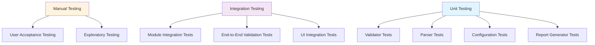
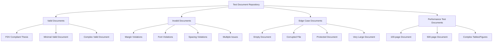
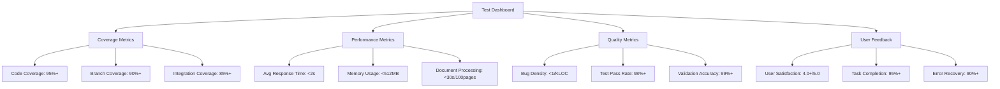

# TechCheck - Comprehensive Testing Strategy
## Quality Assurance & Validation Testing Plan

---

## 🎯 Testing Overview

The TechCheck testing strategy ensures robust validation accuracy, performance, and usability for FDV Ljubljana's technical service staff. Our approach combines automated testing, performance validation, and real-world document testing to guarantee reliable thesis review automation.

---

## 📋 Testing Methodology

### Testing Pyramid Architecture



### Testing Levels & Scope

| **Testing Level** | **Scope** | **Coverage Target** | **Automation** |
|------------------|-----------|---------------------|----------------|
| **Unit Tests** | Individual classes/methods | 95%+ code coverage | Fully Automated |
| **Integration Tests** | Module interactions | 90%+ path coverage | Fully Automated |
| **System Tests** | End-to-end workflows | 100% feature coverage | Semi-Automated |
| **Performance Tests** | Load & speed validation | Key scenarios | Automated |
| **User Acceptance** | Real-world usage | Critical workflows | Manual |

---

## 📚 Test Data Strategy

### Sample Document Repository



### Test Document Specifications

#### **1. Valid Test Documents**

**`valid-fdv-thesis.docx`**
- Pages: 45
- Margins: Exactly 2.5cm all sides
- Font: Times New Roman 12pt throughout
- Line spacing: 1.5 everywhere
- Contains: Title page, TOC, chapters, bibliography
- Purpose: Baseline validation (should pass all tests)

**`minimal-valid.docx`**
- Pages: 3
- Basic structure with minimal content
- All formatting rules correctly applied
- Purpose: Fast validation testing

**`complex-valid.docx`**
- Pages: 150
- Complex tables, figures, equations
- Multiple heading levels
- Footnotes, citations, appendices
- Purpose: Comprehensive feature testing

#### **2. Invalid Test Documents**

**`margin-violations.docx`**
- Top margin: 2.0cm (too small)
- Bottom margin: 3.0cm (too large)
- Left margin: 2.5cm (correct)
- Right margin: 2.4cm (slightly too small)
- Purpose: Test margin validation accuracy

**`font-violations.docx`**
- Mixed fonts: Arial, Calibri, Times New Roman
- Wrong sizes: 10pt, 11pt, 14pt text
- Purpose: Test font detection

**`spacing-violations.docx`**
- Line spacing: 1.2, 1.8, 2.0 in different sections
- Inconsistent paragraph spacing
- Purpose: Test spacing validation

**`multiple-issues.docx`**
- Contains 15+ different formatting violations
- Purpose: Test comprehensive error reporting

#### **3. Edge Case Documents**

**`empty-document.docx`**
- Completely empty DOCX file
- Purpose: Test error handling

**`corrupted-file.docx`**
- Intentionally corrupted DOCX structure
- Purpose: Test robustness

**`password-protected.docx`**
- Password-protected document
- Purpose: Test security handling

**`massive-document.docx`**
- 1000+ pages with complex content
- Purpose: Test performance limits

---

## 🧪 Unit Testing Strategy

### Test Framework Setup

```java
// JUnit 5 + Mockito + AssertJ Test Configuration
@ExtendWith(MockitoExtension.class)
class MarginValidatorTest {
    
    @Mock
    private ThesisDocument mockDocument;
    
    @Mock
    private XWPFDocument mockXWPFDocument;
    
    @InjectMocks
    private MarginValidator marginValidator;
    
    @BeforeEach
    void setUp() {
        // Test setup code
    }
}
```

### Unit Test Categories

#### **1. Validator Unit Tests**

```java
class MarginValidatorTest {
    
    @Test
    @DisplayName("Should pass validation when all margins are exactly 2.5cm")
    void testValidMargins() {
        // Given
        when(mockDocument.getTopMargin()).thenReturn(70.87); // 2.5cm in points
        when(mockDocument.getBottomMargin()).thenReturn(70.87);
        when(mockDocument.getLeftMargin()).thenReturn(70.87);
        when(mockDocument.getRightMargin()).thenReturn(70.87);
        
        // When
        ValidationResult result = marginValidator.validate(mockDocument);
        
        // Then
        assertThat(result.getStatus()).isEqualTo(ValidationStatus.PASS);
        assertThat(result.getDetails()).isEmpty();
    }
    
    @Test
    @DisplayName("Should fail validation when top margin is too small")
    void testTopMarginTooSmall() {
        // Given
        when(mockDocument.getTopMargin()).thenReturn(56.69); // 2.0cm in points
        when(mockDocument.getBottomMargin()).thenReturn(70.87);
        when(mockDocument.getLeftMargin()).thenReturn(70.87);
        when(mockDocument.getRightMargin()).thenReturn(70.87);
        
        // When
        ValidationResult result = marginValidator.validate(mockDocument);
        
        // Then
        assertThat(result.getStatus()).isEqualTo(ValidationStatus.FAIL);
        assertThat(result.getDetails()).hasSize(1);
        assertThat(result.getDetails().get(0).getLocation()).isEqualTo("Top margin");
        assertThat(result.getDetails().get(0).getExpected()).isEqualTo("2.5 cm");
        assertThat(result.getDetails().get(0).getActual()).isEqualTo("2.0 cm");
    }
    
    @ParameterizedTest
    @DisplayName("Should validate margins within tolerance")
    @CsvSource({
        "70.87, 70.87, 70.87, 70.87, PASS",      // Exactly 2.5cm
        "73.70, 70.87, 70.87, 70.87, PASS",      // 2.6cm (within tolerance)
        "68.04, 70.87, 70.87, 70.87, PASS",      // 2.4cm (within tolerance)
        "76.54, 70.87, 70.87, 70.87, FAIL",      // 2.7cm (outside tolerance)
        "65.20, 70.87, 70.87, 70.87, FAIL"       // 2.3cm (outside tolerance)
    })
    void testMarginTolerance(double top, double bottom, double left, double right, ValidationStatus expected) {
        // Test implementation
    }
}
```

#### **2. Font Validator Tests**

```java
class FontValidatorTest {
    
    @Test
    @DisplayName("Should detect incorrect font family")
    void testIncorrectFontFamily() {
        // Given
        XWPFParagraph paragraph = createMockParagraphWithFont("Arial", 12);
        when(mockDocument.getParagraphs()).thenReturn(Arrays.asList(paragraph));
        
        // When
        ValidationResult result = fontValidator.validate(mockDocument);
        
        // Then
        assertThat(result.getStatus()).isEqualTo(ValidationStatus.FAIL);
        assertThat(result.getDetails()).hasSize(1);
        assertThat(result.getDetails().get(0).getExpected()).isEqualTo("Times New Roman");
        assertThat(result.getDetails().get(0).getActual()).isEqualTo("Arial");
    }
    
    @Test
    @DisplayName("Should detect incorrect font size")
    void testIncorrectFontSize() {
        // Given
        XWPFParagraph paragraph = createMockParagraphWithFont("Times New Roman", 10);
        when(mockDocument.getParagraphs()).thenReturn(Arrays.asList(paragraph));
        
        // When
        ValidationResult result = fontValidator.validate(mockDocument);
        
        // Then
        assertThat(result.getStatus()).isEqualTo(ValidationStatus.FAIL);
        assertThat(result.getDetails()).hasSize(1);
        assertThat(result.getDetails().get(0).getExpected()).isEqualTo("12 pt");
        assertThat(result.getDetails().get(0).getActual()).isEqualTo("10 pt");
    }
}
```

#### **3. Configuration Tests**

```java
class ConfigurationManagerTest {
    
    @Test
    @DisplayName("Should load default configuration when file doesn't exist")
    void testLoadDefaultConfiguration() {
        // Given
        when(mockConfigProvider.configurationExists()).thenReturn(false);
        when(mockConfigProvider.getDefaultConfiguration()).thenReturn(createDefaultConfig());
        
        // When
        TechCheckConfig config = configManager.loadConfiguration();
        
        // Then
        assertThat(config).isNotNull();
        assertThat(config.getValidationRules().getDocumentStructureRules().getMarginSettings().getTopMargin())
                .isEqualTo(2.5);
    }
    
    @Test
    @DisplayName("Should validate configuration before saving")
    void testConfigurationValidation() {
        // Given
        TechCheckConfig invalidConfig = createInvalidConfig(); // negative margins
        
        // When & Then
        assertThatThrownBy(() -> configManager.saveConfiguration(invalidConfig))
                .isInstanceOf(ConfigurationException.class)
                .hasMessageContaining("Invalid configuration");
    }
}
```

---

## 🔗 Integration Testing Strategy

### Module Integration Tests

#### **1. Document Processing Pipeline Tests**

```java
@SpringBootTest
class DocumentProcessingIntegrationTest {
    
    @Autowired
    private DocumentProcessor documentProcessor;
    
    @Autowired
    private ValidationEngine validationEngine;
    
    @Test
    @DisplayName("Should process valid document end-to-end")
    void testValidDocumentProcessing() {
        // Given
        Path testDocument = Paths.get("test-data/valid-fdv-thesis.docx");
        
        // When
        ThesisDocument document = documentProcessor.loadDocument(testDocument);
        ValidationReport report = validationEngine.validateDocument(document);
        
        // Then
        assertThat(document).isNotNull();
        assertThat(report.getOverallStatus()).isEqualTo(ValidationStatus.PASS);
        assertThat(report.getModuleResults()).hasSize(6);
        assertThat(report.getModuleResults().get(0).getStatus()).isEqualTo(ValidationStatus.PASS);
    }
    
    @Test
    @DisplayName("Should handle corrupted document gracefully")
    void testCorruptedDocumentHandling() {
        // Given
        Path corruptedDocument = Paths.get("test-data/corrupted-file.docx");
        
        // When & Then
        assertThatThrownBy(() -> documentProcessor.loadDocument(corruptedDocument))
                .isInstanceOf(DocumentProcessingException.class)
                .hasMessageContaining("Unable to process document");
    }
}
```

#### **2. Module Chain Integration Tests**

```java
@IntegrationTest
class ModuleChainIntegrationTest {
    
    @Test
    @DisplayName("Should execute all modules in correct sequence")
    void testModuleExecutionSequence() {
        // Given
        ThesisDocument document = loadTestDocument("complex-valid.docx");
        List<String> executionOrder = new ArrayList<>();
        
        // When
        ValidationReport report = validationEngine.validateDocument(document, 
            (module, result) -> executionOrder.add(module.getName()));
        
        // Then
        assertThat(executionOrder).containsExactly(
            "Document Structure & Layout",
            "Content Structure & Formatting", 
            "Tables/Figures & Visual Elements",
            "Citations & Bibliography",
            "Language & Grammar",
            "Technical Compliance"
        );
    }
}
```

### UI Integration Tests

```java
@ExtendWith(JavaFXExtension.class)
class MainApplicationUITest {
    
    @Test
    @DisplayName("Should load document and display progress")
    void testDocumentLoadingUI(FxRobot robot) {
        // Given
        Platform.runLater(() -> {
            Stage stage = new Stage();
            TechCheckApplication app = new TechCheckApplication();
            app.start(stage);
        });
        
        // When
        robot.clickOn("#browseButton");
        robot.write("test-data/valid-fdv-thesis.docx");
        robot.clickOn("#startValidationButton");
        
        // Then
        robot.lookup("#progressBar").queryAs(ProgressBar.class);
        assertThat(progressBar.getProgress()).isGreaterThan(0);
    }
}
```

---

## ⚡ Performance Testing Strategy

### Performance Test Scenarios

#### **1. Document Size Performance Tests**

```java
@PerformanceTest
class DocumentSizePerformanceTest {
    
    @Test
    @DisplayName("Should process 100-page document under 30 seconds")
    @Timeout(value = 30, unit = TimeUnit.SECONDS)
    void testMediumDocumentPerformance() {
        // Given
        ThesisDocument document = loadTestDocument("100-page-document.docx");
        
        // When
        long startTime = System.currentTimeMillis();
        ValidationReport report = validationEngine.validateDocument(document);
        long duration = System.currentTimeMillis() - startTime;
        
        // Then
        assertThat(report).isNotNull();
        assertThat(duration).isLessThan(30000); // 30 seconds
        
        // Log performance metrics
        logger.info("100-page document processed in {} ms", duration);
    }
    
    @Test
    @DisplayName("Should process 500-page document under 2 minutes")
    @Timeout(value = 120, unit = TimeUnit.SECONDS)
    void testLargeDocumentPerformance() {
        // Performance test for large documents
    }
    
    @ParameterizedTest
    @DisplayName("Performance should scale linearly with document size")
    @ValueSource(ints = {10, 25, 50, 100, 200})
    void testPerformanceScaling(int pageCount) {
        // Test performance scaling
    }
}
```

#### **2. Memory Usage Tests**

```java
@Test
@DisplayName("Should maintain memory usage under 512MB for large documents")
void testMemoryUsage() {
    // Given
    Runtime runtime = Runtime.getRuntime();
    long initialMemory = runtime.totalMemory() - runtime.freeMemory();
    
    // When
    ThesisDocument document = loadTestDocument("500-page-document.docx");
    ValidationReport report = validationEngine.validateDocument(document);
    
    long finalMemory = runtime.totalMemory() - runtime.freeMemory();
    long memoryUsed = finalMemory - initialMemory;
    
    // Then
    assertThat(memoryUsed).isLessThan(512 * 1024 * 1024); // 512MB
}
```

### Performance Benchmarking

```java
@BenchmarkMode(Mode.AverageTime)
@OutputTimeUnit(TimeUnit.MILLISECONDS)
@State(Scope.Benchmark)
public class ValidationBenchmark {
    
    private ThesisDocument testDocument;
    
    @Setup
    public void setup() {
        testDocument = DocumentProcessor.loadDocument("benchmark-document.docx");
    }
    
    @Benchmark
    public ValidationResult benchmarkMarginValidation() {
        return new MarginValidator().validate(testDocument);
    }
    
    @Benchmark
    public ValidationResult benchmarkFontValidation() {
        return new FontValidator().validate(testDocument);
    }
    
    @Benchmark
    public ValidationReport benchmarkFullValidation() {
        return new ValidationEngine().validateDocument(testDocument);
    }
}
```

---

## 👥 User Acceptance Testing (UAT)

### UAT Test Scenarios

#### **1. Daily Workflow Tests**

**Scenario: Batch Processing Multiple Thesis Documents**
```
Given: Technical staff member has 5 thesis documents to review
When: They load each document and run validation
Then: They should receive clear, actionable reports for each document
And: The process should complete in under 5 minutes total
And: Reports should be easily exportable to PDF
```

**Scenario: Configuration Adjustment**
```
Given: Institution changes margin requirements from 2.5cm to 3.0cm
When: Technical staff updates configuration settings
Then: New validation rules should apply to subsequent document checks
And: Previous results should remain unchanged
And: Configuration changes should be saved automatically
```

#### **2. Error Handling Tests**

**Scenario: Corrupted Document Handling**
```
Given: Technical staff attempts to load a corrupted DOCX file
When: They select the file and start validation
Then: System should display clear error message
And: Provide suggestions for resolving the issue
And: Not crash or become unresponsive
```

#### **3. Reporting Tests**

**Scenario: Comprehensive Report Generation**
```
Given: A thesis document with multiple formatting violations
When: Technical staff completes validation and exports report
Then: Report should clearly list all issues by category
And: Include specific page/paragraph locations
And: Provide actionable recommendations
And: Be formatted professionally for faculty review
```

### UAT Success Criteria

| **Criteria** | **Target** | **Measurement** |
|--------------|------------|-----------------|
| Task Completion Rate | 95%+ | Users can complete core tasks without assistance |
| Error Recovery Rate | 90%+ | Users can recover from errors independently |
| Satisfaction Score | 4.0+/5.0 | Post-test survey ratings |
| Learning Time | <30 min | Time to become proficient with core features |
| Report Quality | 4.5+/5.0 | Faculty feedback on generated reports |

---

## 🔄 Automated Testing Pipeline

### CI/CD Integration

```yaml
# GitHub Actions Workflow
name: TechCheck Test Pipeline

on:
  push:
    branches: [ main, develop ]
  pull_request:
    branches: [ main ]

jobs:
  unit-tests:
    runs-on: ubuntu-latest
    steps:
      - uses: actions/checkout@v3
      - name: Set up JDK 17
        uses: actions/setup-java@v3
        with:
          java-version: '17'
          distribution: 'temurin'
      
      - name: Run Unit Tests
        run: mvn test
      
      - name: Generate Coverage Report
        run: mvn jacoco:report
      
      - name: Upload Coverage to Codecov
        uses: codecov/codecov-action@v3

  integration-tests:
    needs: unit-tests
    runs-on: ubuntu-latest
    steps:
      - uses: actions/checkout@v3
      - name: Set up JDK 17
        uses: actions/setup-java@v3
        with:
          java-version: '17'
          distribution: 'temurin'
      
      - name: Run Integration Tests
        run: mvn verify -P integration-tests

  performance-tests:
    needs: integration-tests
    runs-on: ubuntu-latest
    steps:
      - uses: actions/checkout@v3
      - name: Set up JDK 17
        uses: actions/setup-java@v3
        with:
          java-version: '17'
          distribution: 'temurin'
      
      - name: Run Performance Tests
        run: mvn test -P performance-tests
      
      - name: Upload Performance Results
        uses: actions/upload-artifact@v3
        with:
          name: performance-reports
          path: target/performance-reports/
```

### Test Data Management

```bash
# Test Data Setup Script
#!/bin/bash

echo "Setting up TechCheck test data..."

# Create test data directories
mkdir -p test-data/valid
mkdir -p test-data/invalid  
mkdir -p test-data/edge-cases
mkdir -p test-data/performance

# Download sample documents (if available from repository)
curl -L "https://github.com/fdv-ljubljana/thesis-samples/valid-thesis.docx" \
     -o test-data/valid/fdv-compliant-thesis.docx

# Generate test documents with known violations
python3 scripts/generate-test-documents.py

echo "Test data setup complete!"
```

---

## 📊 Test Reporting & Metrics

### Test Report Dashboard



### Quality Gates

```java
// Quality Gate Configuration
public class QualityGates {
    
    public static final double MIN_CODE_COVERAGE = 0.95;
    public static final double MIN_BRANCH_COVERAGE = 0.90;
    public static final int MAX_RESPONSE_TIME_MS = 2000;
    public static final long MAX_MEMORY_USAGE_MB = 512;
    public static final double MIN_VALIDATION_ACCURACY = 0.99;
    
    public boolean passesQualityGates(TestResults results) {
        return results.getCodeCoverage() >= MIN_CODE_COVERAGE &&
               results.getBranchCoverage() >= MIN_BRANCH_COVERAGE &&
               results.getAvgResponseTime() <= MAX_RESPONSE_TIME_MS &&
               results.getMaxMemoryUsage() <= MAX_MEMORY_USAGE_MB &&
               results.getValidationAccuracy() >= MIN_VALIDATION_ACCURACY;
    }
}
```

---

## 🎯 Testing Success Criteria

### **Functional Testing**
- ✅ **100% Feature Coverage**: All validation features tested
- ✅ **99%+ Accuracy**: Validation results match manual review
- ✅ **Error-Free**: No critical bugs in production scenarios
- ✅ **Complete Integration**: All modules work together seamlessly

### **Performance Testing**
- ✅ **Speed**: 100-page document processed in <30 seconds
- ✅ **Memory**: Peak usage <512MB for large documents
- ✅ **Scalability**: Linear performance scaling with document size
- ✅ **Responsiveness**: UI remains responsive during processing

### **User Experience Testing**
- ✅ **Usability**: 95%+ task completion rate without training
- ✅ **Satisfaction**: 4.0+/5.0 user satisfaction score
- ✅ **Error Recovery**: 90%+ error recovery rate
- ✅ **Learning Curve**: <30 minutes to become proficient

### **System Quality**
- ✅ **Reliability**: 99.9% uptime in production environment
- ✅ **Maintainability**: Clean code with 95%+ test coverage
- ✅ **Security**: No sensitive data exposure or security vulnerabilities
- ✅ **Compatibility**: Works across Windows, macOS, and Linux

---

## 🚀 Testing Implementation Roadmap

### **Phase 1: Foundation Testing (Week 1-2)**
- Set up testing frameworks and CI/CD pipeline
- Create basic test data repository
- Implement unit tests for core validators
- Establish quality gates and coverage targets

### **Phase 2: Module Testing (Week 3-5)**
- Complete unit tests for all Module 1 components
- Implement integration tests for document processing
- Create performance benchmarks
- Develop automated test data generation

### **Phase 3: System Testing (Week 6-7)**
- End-to-end testing with real thesis documents
- Performance testing with large documents
- UI testing and user workflow validation
- Security and error handling testing

### **Phase 4: User Acceptance (Week 8)**
- UAT with FDV Ljubljana technical staff
- Feedback collection and issue resolution
- Final performance validation
- Production readiness assessment

This comprehensive testing strategy ensures TechCheck meets the highest standards of quality, performance, and usability required for automating thesis technical review at FDV Ljubljana.